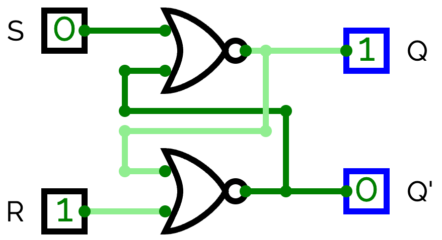
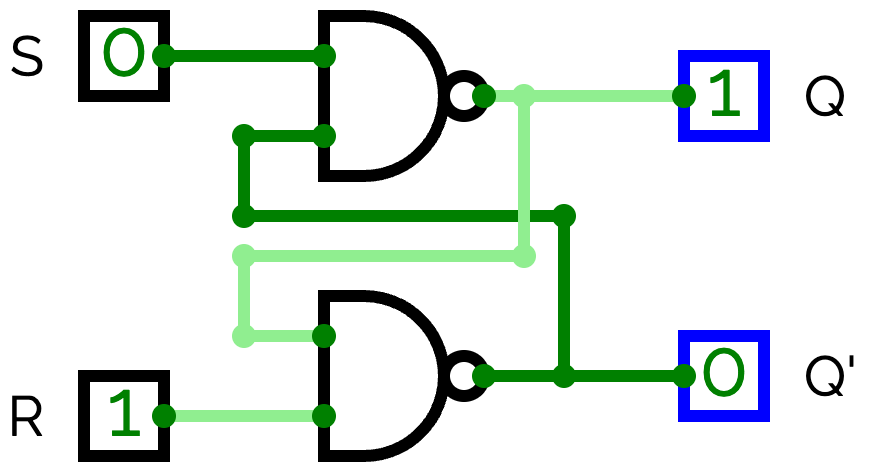
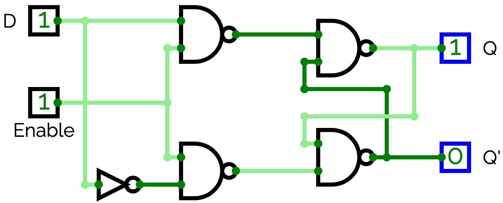
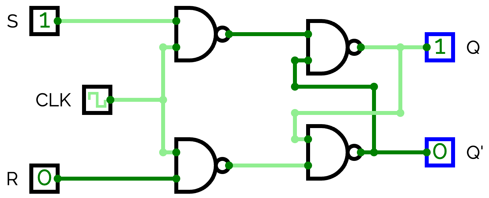
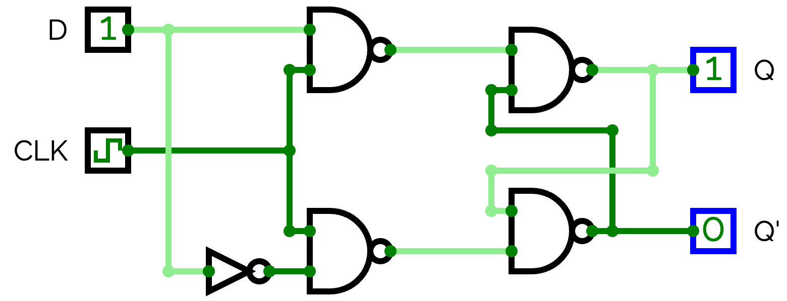
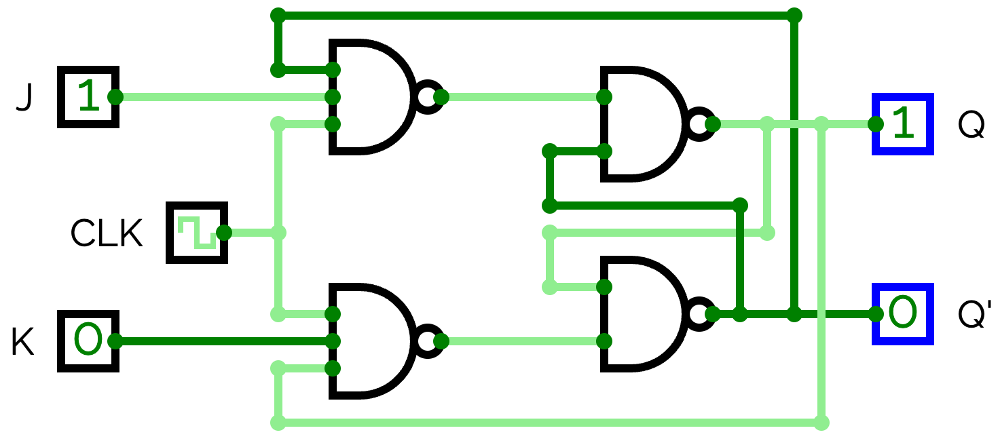
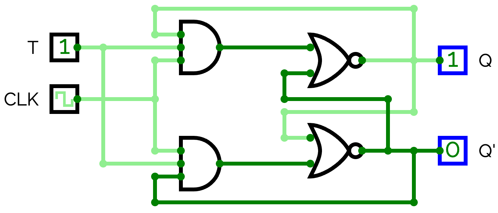

# Chapter 6: ฟลิปฟลอปและวงจรเชิงลำดับ

## Flip-Flops & Sequential Logic

---

## 6.1 บทนำ: Combinational vs Sequential

| เกณฑ์ | Combinational | Sequential |
|:---|:---:|:---:|
| หน่วยความจำ | ❌ ไม่มี | ✅ มี |
| เอาต์พุตขึ้นกับ | อินพุตปัจจุบัน | อินพุต + สถานะก่อนหน้า |
| ตัวอย่าง | Adder, MUX, Decoder | Counter, Register, FSM |

$$\text{Sequential Output} = f(\text{Inputs}, \text{Present State})$$

**วงจรเชิงลำดับ (Sequential Circuit)** มีองค์ประกอบ 2 ส่วน:

```
                ┌──────────────────┐
 Inputs ───────→│  Combinational   │───────→ Outputs
                │     Logic        │
         ┌─────→│                  │──────┐
         │      └──────────────────┘      │
         │      ┌──────────────────┐      │
         └──────│  Memory          │←─────┘
                │  (Flip-Flops)    │
                └───────┬──────────┘
                        ↑
                      Clock
```

---

## 6.2 สัญญาณนาฬิกา (Clock Signal)

Clock คือสัญญาณ Square Wave ที่ทำหน้าที่ **ซิงโครไนซ์** วงจรทั้งหมด

```
         t0   t1   t2   t3   t4   t5   t6   t7
CLK:   _____|‾‾‾‾|____|‾‾‾‾|____|‾‾‾‾|____|‾‾‾‾
            ↑    ↓    ↑    ↓    ↑    ↓    ↑
            |    |    |    |    |    |    |
         Rise Fall Rise Fall Rise Fall Rise
         Edge Edge Edge Edge Edge Edge Edge
            |‾‾‾‾|____|
            tHIGH tLOW
            |<-- T -->|
            ↑
       Positive (Rising) Edge

  Duty Cycle = tHIGH / T × 100%
```

| คำศัพท์ | ความหมาย |
|:---|:---|
| **Positive Edge (↑)** | ขอบขาขึ้น (0→1) — Flip-flop ส่วนใหญ่ trigger ที่นี่ |
| **Negative Edge (↓)** | ขอบขาลง (1→0) — JK FF บางชนิด trigger ที่นี่ |
| **Period (T)** | เวลา 1 รอบ Clock เต็ม |
| **Frequency (f)** | จำนวนรอบต่อวินาที = 1/T |
| **Duty Cycle** | % เวลาที่ CLK = HIGH (ปกติ 50%) |
| **Setup Time** | เวลาที่ Input ต้องคงค่าก่อน Active Edge |
| **Hold Time** | เวลาที่ Input ต้องคงค่าหลัง Active Edge |

---

## 6.3 วงจรแลตช์ (Latches) — หน่วยความจำพื้นฐาน

**Latch** คือวงจรความจำที่ทำงานแบบ **Level-sensitive** —
เอาต์พุตเปลี่ยนได้ตลอดเวลาที่ Enable อยู่ในระดับที่กำหนด

---

### SR Latch (NOR-based)

ประกอบด้วย NOR gate 2 ตัว ต่อ Cross-Feedback กัน:



| S | R | Q(next) | Q̄(next) | สถานะ |
|:---:|:---:|:---:|:---:|:---|
| 0 | 0 | Q₀ | Q̄₀ | **Hold** — ค้างค่าเดิม |
| 0 | 1 | 0 | 1 | **Reset** — บังคับ Q=0 |
| 1 | 0 | 1 | 0 | **Set** — บังคับ Q=1 |
| 1 | 1 | ❌ | ❌ | **Invalid** — ห้ามใช้! |

#### Timing Diagram — SR Latch

```
         t0   t1   t2   t3   t4   t5   t6   t7

S:     _____|‾‾‾‾|_____________________________________

R:     ________________________|‾‾‾‾‾‾‾‾‾|____________

Q:     _____|‾‾‾‾‾‾‾‾‾‾‾‾‾‾‾‾‾‾‾‾‾‾‾‾‾|____________

Q̄:    ‾‾‾‾‾|_________________________|‾‾‾‾‾‾‾‾‾‾‾‾
```

| ช่วง | t0 | t1 | t2 | t3 | t4 | t5 | t6 | t7 |
|:---:|:---:|:---:|:---:|:---:|:---:|:---:|:---:|:---:|
| S | 0 | **1** | 0 | 0 | 0 | 0 | 0 | 0 |
| R | 0 | 0 | 0 | 0 | **1** | **1** | 0 | 0 |
| **Q** | **0** | **1** | 1 | 1 | 1 | **0** | 0 | 0 |
| **Q̄** | **1** | **0** | 0 | 0 | 0 | **1** | 1 | 1 |

- **t1:** S=1 → **Set** — Q กลายเป็น 1
- **t2:** S กลับ 0 → Q **Hold** ค่าไว้ที่ 1
- **t4–t5:** R=1 → **Reset** — Q กลายเป็น 0
- **t6:** R กลับ 0 → Q **Hold** ค่าไว้ที่ 0

---

### SR Latch (NAND-based, Active Low)

ใช้ NAND gate 2 ตัว — อินพุต **Active LOW** (ส่ง 0 เพื่อทำงาน)



| S̄ | R̄ | Q | Q̄ | สถานะ |
|:---:|:---:|:---:|:---:|:---|
| 1 | 1 | Q₀ | Q̄₀ | Hold |
| 1 | 0 | 0 | 1 | Reset |
| 0 | 1 | 1 | 0 | Set |
| 0 | 0 | ❌ | ❌ | Invalid |

> 💡 **NAND Latch** ใช้ในวงจรจริงบ่อยกว่า NOR เพราะ NAND เป็น Universal Gate

---

### D Latch (Data / Transparent Latch)

แก้ปัญหา Invalid state ของ SR — ใช้อินพุตเพียง **1 ตัว** (D)
บังคับให้ S และ R ตรงข้ามกันเสมอ (R = S̄)



$$Q_{next} = D \quad \text{(เมื่อ E = 1)}$$

| E | D | Q(next) | หมายเหตุ |
|:---:|:---:|:---:|:---|
| 0 | X | Q₀ | **Hold** — ไม่ว่า D จะเปลี่ยนอย่างไร |
| 1 | 0 | 0 | **Reset** |
| 1 | 1 | 1 | **Set** |

#### Timing Diagram — D Latch (Transparent)

```
         t0   t1   t2   t3   t4   t5   t6   t7

E:     ___________|‾‾‾‾‾‾‾‾‾|_______|‾‾‾‾‾‾‾‾‾

D:     _____|‾‾‾‾‾‾‾‾‾‾|_____|‾‾‾‾‾‾‾‾‾‾‾‾‾|____

Q:     ___________|‾‾‾‾‾|____________|‾‾‾‾‾‾|____
                  ★             ★
              (Q = D,        (Q ≠ D,
              E=1 follow)     E=0 hold)
```

| ช่วง | t0 | t1 | t2 | t3 | t4 | t5 | t6 | t7 |
|:---:|:---:|:---:|:---:|:---:|:---:|:---:|:---:|:---:|
| E | 0 | 0 | **1** | 1 | **0** | 0 | **1** | 1 |
| D | 0 | 1 | 1 | 0 | 1 | 1 | 1 | 0 |
| **Q** | **0** | **0** | **1** | **0** | **0** | **0** | **1** | **0** |

| ช่วง | เหตุการณ์ |
|:---:|:---|
| t0 | E=0, D=0 → Q=0 (Hold) |
| t1 | E=0, D=1 → **Q ยังคง 0** (Hold ไม่ตาม D ← จุดสำคัญ!) |
| t2 | E=1, D=1 → Q=1 (Transparent — Q ตาม D ทันที) |
| t3 | E=1, D=0 → Q=0 (Transparent — Q ตาม D ทันที) |
| t4 | E=0, D=1 → **Q คง 0** (Hold ค่าสุดท้าย = 0) |
| t5 | E=0, D=1 → Q=0 (Hold ต่อเนื่อง ไม่ตาม D) |
| t6 | E=1, D=1 → Q=1 (Transparent อีกครั้ง) |
| t7 | E=1, D=0 → Q=0 ← เนื้อหาต่อเนื่อง |

> ⚠️ **ข้อเสีย Latch (Level-sensitive):** เอาต์พุตเปลี่ยนได้ **ตลอดเวลา** ที่ E=1
> อาจเกิด glitch หรือ race condition ในวงจรใหญ่ → ใช้ **Flip-Flop** แทนเมื่อต้องการความเสถียร

---

## 6.4 Flip-Flop vs Latch

| เกณฑ์ | Latch | Flip-Flop |
|:---|:---:|:---:|
| Trigger | **Level**-sensitive | **Edge**-sensitive |
| เปลี่ยนสถานะเมื่อ | Enable = 1 (ตลอดเวลา) | เฉพาะ **ขอบ** Clock เท่านั้น |
| ความเสถียร | ต่ำกว่า ⚠️ | สูง ✅ |
| Glitch | เป็นไปได้ | ป้องกันได้ดีกว่า |
| การใช้งาน | Asynchronous circuit | **Synchronous circuit** ✅ |

> 💡 **Flip-Flop = Edge-triggered Latch** — จับค่าเพียงชั่วขณะที่ขอบ Clock แล้วล็อกค่าไว้

---

## 6.4.1 ปัญหา Race-Around ใน JK Latch และ Master-Slave

เมื่อป้อน J=1, K=1 เข้าไปใน JK Latch ที่ใช้ Level-Trigger หาก Clock = 1 นานเกินไป เอาต์พุตจะสลับค่ากลับไปมา (Toggle) หลายรอบจนคาดเดาไม่ได้ เรียกว่า **Race-Around Condition**
**วิธีแก้:**
1. ใช้ Edge-Triggered Flip-Flop
2. ใช้โครงสร้าง **Master-Slave Flip-Flop**:
   - นำ Latch 2 ตัวมาต่อกัน (ตัว Master ทำงานเมื่อ CLK=1, ตัว Slave ทำงานเมื่อ CLK=0)
   - ข้อมูลจะเข้า Master ก่อน แล้วส่งให้ Slave เมื่อ Clock เปลี่ยน ทำให้เอาต์พุตเปลี่ยนเพียง 1 ครั้งต่อ 1 รอบ Clock อย่างปลอดภัย

## 6.4.2 Metastability (สภาวะกึ่งเสถียร)

หากฝืนกฎ **Setup Time** (ข้อมูลไม่นิ่งก่อนขอบคล็อก) หรือ **Hold Time** (ข้อมูลเปลี่ยนเร็วไปหลังขอบคล็อก) Flip-Flop อาจตกอยู่ในสภาวะ **Metastability**
คือเอาต์พุตไม่ได้เป็น 0 และไม่ได้เป็น 1 (แรงดันอยู่กึ่งกลาง) สักระยะหนึ่งก่อนจะตกลงไปค่าใดค่าหนึ่งแบบสุ่ม สภาวะนี้เป็นอันตรายต่อระบบดิจิทัลอย่างยิ่ง มักเกิดเมื่อรับสัญญาณที่ไม่สัมพันธ์กับคล็อก (Asynchronous Input) จึงต้องแกไขโดยใช้ **Synchronizer** (ต่อ D FF เรียงกัน 2 สเตจ)

## 6.5 SR Flip-Flop

เหมือน SR Latch แต่เปลี่ยนสถานะ **เฉพาะที่ขอบ Positive Edge** ของ Clock



| Clock Edge | S | R | Q(next) | สถานะ |
|:---:|:---:|:---:|:---:|:---|
| ↑ | 0 | 0 | Q₀ | Hold |
| ↑ | 0 | 1 | 0 | Reset |
| ↑ | 1 | 0 | 1 | Set |
| ↑ | 1 | 1 | ❌ | Invalid — ห้ามใช้! |

**Characteristic Equation:**

$$Q^+ = S + \overline{R} \cdot Q \quad \text{(เงื่อนไข: } S \cdot R = 0\text{)}$$

#### Timing Diagram — SR Flip-Flop (Positive Edge)

```
         t0   t1   t2   t3   t4   t5   t6   t7
              ↑         ↑         ↑         ↑
CLK:   _____|‾‾‾‾|____|‾‾‾‾|____|‾‾‾‾|____|‾‾‾‾

S:     _____|‾‾‾‾‾‾‾‾‾‾‾‾‾|_________________________

R:     _____________________________|‾‾‾‾‾‾‾‾‾|__

Q:     _________________|‾‾‾‾‾‾‾‾‾‾‾‾‾‾‾‾‾‾‾|___
```

| ช่วง | t0 | t1↑ | t2 | t3↑ | t4 | t5↑ | t6 | t7↑ |
|:---:|:---:|:---:|:---:|:---:|:---:|:---:|:---:|:---:|
| S | 0 | **1** | 1 | **1** | 0 | 0 | 0 | 0 |
| R | 0 | 0 | 0 | 0 | 0 | 0 | **1** | **1** |
| **Q** | **0** | **0→?** | 0 | **1** | 1 | **1** | 1 | **0** |

- **t1↑:** S=1, R=0 → **Set** แต่ Q เพิ่ง Capture S=1 ตอน t1 (ต้องดูว่า S active ก่อน edge หรือไม่)
  - ที่ t1↑: S=1 → Q ควรเป็น 1 แต่เนื่องจาก S เพิ่งขึ้นพร้อม edge จึงต้องระวัง Setup Time
- **t3↑:** S=1, R=0 → **Set** → Q=1
- **t5↑:** S=0, R=0 → **Hold** → Q คง 1
- **t7↑:** S=0, R=1 → **Reset** → Q=0

> ⚠️ SR FF มีข้อเสียเรื่อง Invalid state (S=R=1) → ใช้ **JK FF** แทนเมื่อต้องการครบทุกโหมด

---

## 6.6 D Flip-Flop ⭐ (ใช้มากที่สุด)

ข้อมูลถูก "จับ" (Capture/Sample) ที่ **ขอบ Positive Edge** ของ Clock เท่านั้น



$$Q^+ = D$$

| Clock Edge | D | Q(next) | หมายเหตุ |
|:---:|:---:|:---:|:---|
| ↑ | 0 | 0 | จับค่า D=0 |
| ↑ | 1 | 1 | จับค่า D=1 |
| ไม่มี Edge | X | Q₀ | **Hold** — Q ไม่เปลี่ยน |

**IC: 7474** (Dual D Flip-Flop, Positive-Edge Triggered)

#### Timing Diagram — D Flip-Flop (Positive Edge)

```
         t0   t1   t2   t3   t4   t5   t6   t7
              ↑         ↑         ↑         ↑
CLK:   _____|‾‾‾‾|____|‾‾‾‾|____|‾‾‾‾|____|‾‾‾‾

D:     ___________|‾‾‾‾‾‾‾‾‾‾‾‾‾‾‾‾‾‾‾|________

Q:     _______________|‾‾‾‾‾‾‾‾‾‾‾‾‾‾‾‾‾‾‾‾|____
                          ★         ★         ★
```

| ช่วง | t0 | t1↑ | t2 | t3↑ | t4 | t5↑ | t6 | t7↑ |
|:---:|:---:|:---:|:---:|:---:|:---:|:---:|:---:|:---:|
| CLK | 0 | ↑ | 0 | ↑ | 0 | ↑ | 0 | ↑ |
| D | 0 | 0 | 1 | 1 | 1 | 1 | 1 | 0 |
| **Q** | **0** | **0** | 0 | **1** | 1 | **1** | 1 | **0** |

| Active Edge | D ขณะนั้น | Q หลัง Edge | โหมด |
|:---:|:---:|:---:|:---:|
| t1↑ | 0 | 0 | Hold (D=0 → Q=0) |
| t3↑ | 1 | 1 | Capture D=1 |
| t5↑ | 1 | 1 | Hold (D=1 → Q=1) |
| t7↑ | 0 | 0 | Capture D=0 |

> 💡 **กฎสำคัญ:** Q จับค่า D เฉพาะ **ณ ขณะขอบ ↑** เท่านั้น
> D จะเปลี่ยนกี่ครั้งระหว่าง Clock ก็ไม่มีผลต่อ Q จนกว่าจะถึง Edge ถัดไป

**IC: 74175** (Quad D FF), **74374** (Octal D FF with 3-state output)

---

## 6.7 JK Flip-Flop ⭐ (อเนกประสงค์)

แก้ปัญหา Invalid ของ SR — เมื่อ J=K=1 จะ **Toggle** (สลับสถานะ) แทนที่จะ Invalid



| Clock Edge | J | K | Q(next) | โหมด |
|:---:|:---:|:---:|:---:|:---|
| ↓ | 0 | 0 | Q₀ | **Hold** |
| ↓ | 0 | 1 | 0 | **Reset** |
| ↓ | 1 | 0 | 1 | **Set** |
| ↓ | 1 | 1 | Q̄₀ | **Toggle** ⭐ |

**Characteristic Equation:**

$$Q^+ = J\overline{Q} + \overline{K}Q$$

**IC: 7473** (Dual JK FF, Negative-Edge), **7476** (Dual JK FF with Preset/Clear)

#### Timing Diagram — JK Flip-Flop (Negative Edge) — ทุกโหมด

```
         t0   t1   t2   t3   t4   t5   t6   t7
              ↓         ↓         ↓         ↓
CLK:   ‾‾‾‾‾|____|‾‾‾‾|____|‾‾‾‾|____|‾‾‾‾|____

J:     ___________|‾‾‾‾‾‾‾‾‾|___________|‾‾‾‾‾‾

K:     _____________________|‾‾‾‾‾‾‾‾‾‾‾‾‾‾‾‾‾‾

Q:     ________________________|‾‾‾‾‾‾‾‾‾|_____|‾
```

| ช่วง | t0 | t1↓ | t2 | t3↓ | t4 | t5↓ | t6 | t7↓ |
|:---:|:---:|:---:|:---:|:---:|:---:|:---:|:---:|:---:|
| J | 0 | 0 | 1 | 1 | 0 | 0 | 1 | 1 |
| K | 0 | 0 | 0 | 0 | 1 | 1 | 1 | 1 |
| **Q** | **0** | **0** | 0 | **1** | 1 | **0** | 0 | **1** |
| โหมด | — | Hold | — | Set | — | Reset | — | Toggle |

| Active Edge | J | K | Q ก่อน | Q หลัง | โหมด |
|:---:|:---:|:---:|:---:|:---:|:---:|
| t1↓ | 0 | 0 | 0 | 0 | **Hold** |
| t3↓ | 1 | 0 | 0 | 1 | **Set** |
| t5↓ | 0 | 1 | 1 | 0 | **Reset** |
| t7↓ | 1 | 1 | 0 | 1 | **Toggle** (0→1) |

#### Timing Diagram — JK FF Toggle Mode (J=K=1 ตลอด)

เมื่อ J=K=1 → JK FF ทำหน้าที่เป็น **Frequency Divider** ÷2

```
         t0   t1   t2   t3   t4   t5   t6   t7
              ↓         ↓         ↓         ↓
CLK:   ‾‾‾‾‾|____|‾‾‾‾|____|‾‾‾‾|____|‾‾‾‾|____

J:     ‾‾‾‾‾‾‾‾‾‾‾‾‾‾‾‾‾‾‾‾‾‾‾‾‾‾‾‾‾‾‾‾‾‾‾‾‾‾‾‾

K:     ‾‾‾‾‾‾‾‾‾‾‾‾‾‾‾‾‾‾‾‾‾‾‾‾‾‾‾‾‾‾‾‾‾‾‾‾‾‾‾‾

Q:     ___________|‾‾‾‾‾‾‾‾‾|___________|‾‾‾‾‾‾
       (Q=0)   (Q=1)      (Q=0)       (Q=1)
```

| ช่วง | t1↓ | t3↓ | t5↓ | t7↓ |
|:---:|:---:|:---:|:---:|:---:|
| J | 1 | 1 | 1 | 1 |
| K | 1 | 1 | 1 | 1 |
| Q ก่อน | 0 | 1 | 0 | 1 |
| **Q หลัง** | **1** | **0** | **1** | **0** |

> 💡 ความถี่ Q = ½ ความถี่ CLK → ใช้เป็น **÷2 Frequency Divider**

---

## 6.8 T Flip-Flop (Toggle)

สร้างจาก JK FF โดยต่อ J = K = T



$$Q^+ = T \oplus Q$$

| Clock Edge | T | Q(next) | โหมด |
|:---:|:---:|:---:|:---|
| ↑ | 0 | Q₀ | **Hold** — ไม่เปลี่ยน |
| ↑ | 1 | Q̄₀ | **Toggle** — สลับสถานะ |

#### Timing Diagram — T Flip-Flop (Positive Edge)

```
         t0   t1   t2   t3   t4   t5   t6   t7
              ↑         ↑         ↑         ↑
CLK:   _____|‾‾‾‾|____|‾‾‾‾|____|‾‾‾‾|____|‾‾‾‾

T:     _____|‾‾‾‾‾‾‾‾‾|_____|‾‾‾‾‾‾‾‾‾‾‾‾‾|____

Q:     ___________|‾‾‾‾‾‾‾‾‾‾‾‾‾‾‾|_________|‾‾‾‾
```

| ช่วง | t0 | t1↑ | t2 | t3↑ | t4 | t5↑ | t6 | t7↑ |
|:---:|:---:|:---:|:---:|:---:|:---:|:---:|:---:|:---:|
| T | 0 | **1** | 1 | 0 | 0 | **1** | 1 | **1** |
| Q ก่อน | 0 | 0 | — | 1 | — | 1 | — | 0 |
| **Q หลัง** | — | **1** | — | **1** | — | **0** | — | **1** |
| โหมด | — | Toggle | — | Hold | — | Toggle | — | Toggle |

- **t1↑:** T=1, Q=0 → **Toggle** → Q=1
- **t3↑:** T=0, Q=1 → **Hold** → Q=1
- **t5↑:** T=1, Q=1 → **Toggle** → Q=0
- **t7↑:** T=1, Q=0 → **Toggle** → Q=1

> 💡 T FF เป็น **Frequency Divider ÷2** เมื่อ T=1 ตลอด
> ต่อกัน 4 ตัว → **÷16 Counter** (ดูบทที่ 7)

---

## 6.9 สรุปเปรียบเทียบ Flip-Flop ทุกชนิด

| ชนิด | Trigger | Characteristic Equation | จุดเด่น | จุดด้อย |
|:---:|:---:|:---|:---|:---|
| SR | ↑ | $Q^+ = S + \overline{R}Q$ | พื้นฐาน ง่าย | มี Invalid (SR=1) |
| **D** ⭐ | ↑ | $Q^+ = D$ | ง่ายที่สุด ไม่มี Invalid | ไม่มี Toggle โดยตรง |
| **JK** ⭐ | ↓ | $Q^+ = J\overline{Q} + \overline{K}Q$ | มีครบทุกโหมด (Hold/Set/Reset/Toggle) | ซับซ้อนกว่า |
| T | ↑ | $Q^+ = T \oplus Q$ | Frequency Divider | มีแค่ Hold/Toggle |

---

## 6.10 Excitation Table (ตารางกระตุ้น) ⭐

ใช้ในการ **ออกแบบวงจร Sequential** — หาค่า Input ที่ต้องใส่เพื่อให้ FF เปลี่ยนสถานะตามต้องการ

| Q → Q⁺ | SR | D | JK | T |
|:---:|:---:|:---:|:---:|:---:|
| 0 → 0 | 0X | 0 | 0X | 0 |
| 0 → 1 | 10 | 1 | 1X | 1 |
| 1 → 0 | 01 | 0 | X1 | 1 |
| 1 → 1 | X0 | 1 | X0 | 0 |

> **X = Don't Care** (0 หรือ 1 ก็ได้ ไม่มีผลต่อผลลัพธ์)

### วิธีอ่าน Excitation Table

**ตัวอย่าง JK:** ถ้าต้องการให้ Q เปลี่ยน 0 → 1 ต้องใส่ J=1, K=X (K เป็น 0 หรือ 1 ก็ได้)

```
  จำง่าย: J ทำให้ Q=1 (J=1 → Set)
          K ทำให้ Q=0 (K=1 → Reset)

  0→0: J=0 (อย่า Set), K=X → จาก Q=0 คงอยู่ที่ 0
  0→1: J=1 (ต้อง Set), K=X
  1→0: J=X,  K=1 (ต้อง Reset)
  1→1: J=X,  K=0 (อย่า Reset) → คงอยู่ที่ 1
```

---

## 6.11 Preset และ Clear (Asynchronous Inputs)

FF ส่วนใหญ่มี **Preset (PRE)** และ **Clear (CLR)** สำหรับตั้งค่าเริ่มต้น
ทำงาน **ทันที โดยไม่ต้องรอ Clock** (Asynchronous)

| PRE | CLR | Q | หมายเหตุ |
|:---:|:---:|:---:|:---|
| 0 | 1 | 1 | **Force SET** (Active Low) — ไม่สนใจ CLK |
| 1 | 0 | 0 | **Force RESET** (Active Low) — ไม่สนใจ CLK |
| 1 | 1 | ปกติ | ทำงานตาม Clock (Normal mode) |
| 0 | 0 | ❌ | **Invalid** |

#### Timing Diagram — D FF with Preset & Clear

```
         t0   t1   t2   t3   t4   t5   t6   t7
              ↑         ↑         ↑         ↑
CLK:   _____|‾‾‾‾|____|‾‾‾‾|____|‾‾‾‾|____|‾‾‾‾

PRĒ:   ‾‾‾‾‾‾‾‾‾‾‾‾‾‾‾‾‾|____|‾‾‾‾‾‾‾‾‾‾‾‾‾‾‾‾‾
                          ↓ async
CLR̄:   ‾‾‾‾‾‾‾‾‾‾‾‾‾‾‾‾‾‾‾‾‾‾‾‾‾‾‾‾‾|____|‾‾‾‾‾
                                      ↓ async
D:     ___________|‾‾‾‾‾‾‾‾‾‾‾‾‾‾‾‾‾‾‾‾‾‾‾‾‾|__

Q:     _______________|‾‾‾‾‾‾‾‾‾|‾‾‾‾‾‾‾‾‾|____
                              ★           ★
                         (PRE→Q=1)  (CLR→Q=0)
                          ไม่ต้องรอ   ไม่ต้องรอ
                            CLK         CLK
```

| ช่วง | t0 | t1↑ | t2 | t3↑ | PRE↓ | t4 | CLR↓ | t5↑ |
|:---:|:---:|:---:|:---:|:---:|:---:|:---:|:---:|:---:|
| CLK | 0 | ↑ | 0 | ↑ | — | 0 | — | ↑ |
| PRĒ | 1 | 1 | 1 | 1 | **0** | 1 | 1 | 1 |
| CLR̄ | 1 | 1 | 1 | 1 | 1 | 1 | **0** | 1 |
| D | 0 | 0 | 1 | 1 | X | 1 | X | 1 |
| **Q** | **0** | **0** | 0 | **1** | **→1** | 1 | **→0** | **1** |

- **t3↑:** D=1 → Q ถูก Capture เป็น 1 ตาม Clock
- **PRĒ↓:** PRĒ=0 → Q=1 **ทันที** (ไม่ต้องรอ Clock)
- **CLR̄↓:** CLR̄=0 → Q=0 **ทันที** (ไม่ต้องรอ Clock)
- **t5↑:** กลับสู่ Normal mode, D=1 → Q=1

> 💡 **ใช้ PRE/CLR สำหรับ:** Reset ระบบทั้งหมดตอนเริ่มต้น (Power-on Reset)
> หรือบังคับสถานะของ Register ก่อนเริ่มการทำงาน

---

## 6.12 การประยุกต์ใช้ Flip-Flop

| การประยุกต์ | FF ที่ใช้ | หลักการ |
|:---|:---:|:---|
| **Data Register** | D FF | เก็บค่า n บิต ด้วย D FF n ตัว |
| **Shift Register** | D FF | ต่อ Q ของตัวหนึ่งเข้า D ของตัวถัดไป |
| **Frequency Divider** | T FF / JK FF | ÷2 ต่อหนึ่ง FF |
| **Binary Counter** | T FF / JK FF | นับเลขฐานสอง |
| **Debounce Circuit** | D FF | กำจัด glitch จาก mechanical switch |
| **FSM State Memory** | D FF | เก็บ Present State ของ FSM |

### ตัวอย่าง: 4-bit Data Register

ใช้ D FF 4 ตัว — จับข้อมูล 4 บิตพร้อมกันที่ขอบ Clock

```
  D3 -> [D FF] -> Q3
  D2 -> [D FF] -> Q2     (CLK ต่อร่วมกัน)
  D1 -> [D FF] -> Q1
  D0 -> [D FF] -> Q0
              ^
            CLK (เดียวกัน)
```

### ตัวอย่าง: Frequency Divider ÷8 จาก T FF

```
  CLK ---> [T FF, T=1] --> Q0 (÷2)
                     Q0 --> [T FF, T=1] --> Q1 (÷4)
                                      Q1 --> [T FF, T=1] --> Q2 (÷8)
```

---

## แบบฝึกหัดท้ายบท

1. อธิบายความแตกต่างระหว่าง Latch กับ Flip-Flop พร้อม Timing Diagram ประกอบ
2. วาด Timing Diagram ของ D Latch เมื่อ E และ D เปลี่ยนแปลงโดยอิสระ — แสดง 3 กรณี: E=1 ขณะ D เปลี่ยน, E=0 ขณะ D เปลี่ยน, E ขึ้นหลัง D เปลี่ยน
3. วาด Timing Diagram ของ JK FF (Negative Edge) เมื่อ J=1, K=1 เป็นเวลา 8 clock cycles (เริ่มจาก Q=0)
4. ใช้ Excitation Table หา JK inputs สำหรับลำดับสถานะ: 0 → 1 → 1 → 0 → 0 → 1 → ...
5. ออกแบบ 2-bit Binary Counter จาก T FF — เขียน State Diagram และ Timing Diagram
6. สร้าง D Flip-Flop จาก NAND gates 4 ตัว (วาดแผนผัง)
7. ต่อวงจร JK FF บน **Tinkercad** โดยใช้ IC 7473 ในโหมด Toggle และแสดงผลด้วย LED
8. อธิบายว่าทำไมต้องมี Setup Time และ Hold Time — เกิดอะไรขึ้นถ้าละเมิดเงื่อนไขนี้
