# Chapter 7: ตัวนับและรีจิสเตอร์

## Counters & Registers

---

## 7.1 บทนำ

**Counter** และ **Register** เป็นวงจร Sequential พื้นฐานที่สร้างจาก Flip-Flop:

| วงจร | คำนิยาม | ตัวอย่าง IC |
|:---|:---|:---:|
| **Counter** | วงจรที่เปลี่ยนสถานะตามลำดับที่กำหนดทุก Clock cycle | 7490, 74163 |
| **Register** | กลุ่ม Flip-Flop ที่เก็บข้อมูลหลายบิตพร้อมกัน | 74194, 74374 |

$$\text{n-bit Counter} = \text{n Flip-Flops} \Rightarrow \text{นับได้ } 2^n \text{ สถานะ}$$

**ประเภทหลักของ Counter:**

| ประเภท | ลักษณะ |
|:---|:---|
| **Asynchronous (Ripple)** | Clock ป้อนแค่ FF แรก — FF ถัดไปใช้ Q ของตัวก่อน |
| **Synchronous** | Clock เดียวกันป้อนทุก FF พร้อมกัน |
| **Up Counter** | นับขึ้น 0, 1, 2, 3, … |
| **Down Counter** | นับลง …, 3, 2, 1, 0 |
| **MOD-N** | นับวนรอบ N สถานะ (ไม่จำเป็นต้องเป็น 2ⁿ) |

---

# ส่วนที่ 1: ตัวนับ (Counters)

---

## 7.2 Asynchronous (Ripple) Counter

### หลักการ

- Clock ป้อนเข้าเฉพาะ **FF ตัวแรก (Q₀)** เท่านั้น
- **Q ของ FF ตัวหนึ่ง** → ทำหน้าที่เป็น Clock ของ FF ตัวถัดไป
- ใช้ **T Flip-Flop** (หรือ JK FF ที่ J=K=1) → สลับสถานะทุก clock
- Q₀ นับที่ความถี่ = CLK÷2, Q₁ = CLK÷4, Q₂ = CLK÷8 → **Frequency Divider**

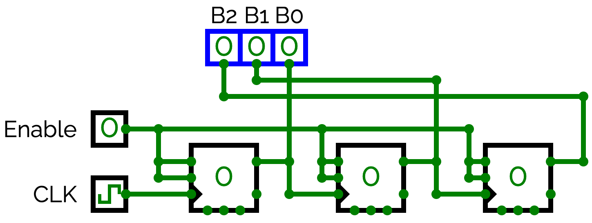

### Timing Diagram — 3-bit Binary Up Counter

```
         t0   t1   t2   t3   t4   t5   t6   t7   t8
              ↓    ↓    ↓    ↓    ↓    ↓    ↓    ↓
CLK:   ‾‾‾‾‾|____|‾‾‾‾|____|‾‾‾‾|____|‾‾‾‾|____|‾‾‾‾|____

Q₀:    _____|‾‾‾‾‾‾‾‾‾|_____|‾‾‾‾‾‾‾‾‾|_____|‾‾‾‾‾‾‾‾‾|__

Q₁:    _____|‾‾‾‾‾‾‾‾‾‾‾‾‾‾‾‾‾‾‾|_____|‾‾‾‾‾‾‾‾‾‾‾‾‾‾‾‾‾‾‾

Q₂:    _____|‾‾‾‾‾‾‾‾‾‾‾‾‾‾‾‾‾‾‾‾‾‾‾‾‾‾‾‾‾‾‾‾‾‾‾‾‾|_______
```

| ช่วง | t0 | t1↓ | t2↓ | t3↓ | t4↓ | t5↓ | t6↓ | t7↓ | t8↓ |
|:---:|:---:|:---:|:---:|:---:|:---:|:---:|:---:|:---:|:---:|
| Q₂ | 0 | 0 | 0 | 0 | 1 | 1 | 1 | 1 | **0** |
| Q₁ | 0 | 0 | 1 | 1 | 0 | 0 | 1 | 1 | **0** |
| Q₀ | 0 | 1 | 0 | 1 | 0 | 1 | 0 | 1 | **0** |
| **Count** | **0** | **1** | **2** | **3** | **4** | **5** | **6** | **7** | **0** |

- **Q₀:** Toggle ที่ทุก **Negative Edge ของ CLK** (÷2)
- **Q₁:** Toggle ที่ทุก **Negative Edge ของ Q₀** (÷4)
- **Q₂:** Toggle ที่ทุก **Negative Edge ของ Q₁** (÷8)
- หลังจาก t7 → นับครบ 8 รอบ → **วนกลับ 0** (MOD-8)

> ⚠️ **Propagation Delay:** Q₂ เปลี่ยนสถานะช้ากว่า Q₀ เพราะต้องรอ delay ผ่าน FF ทุกตัว
> ยิ่งมี FF มาก ยิ่งช้า → **ไม่เหมาะกับความถี่สูง**

---

### 4-bit Ripple Up Counter (MOD-16)

- หลักการเดียวกับ 3-bit แต่เพิ่ม **FF₃ (Q₃)** → ใช้ลำดับ Q₀→Q₁→Q₂→Q₃
- Q₃ Toggle ที่ **Negative Edge ของ Q₂** (÷16)
- นับ 0 → 1 → 2 → … → 15 → 0

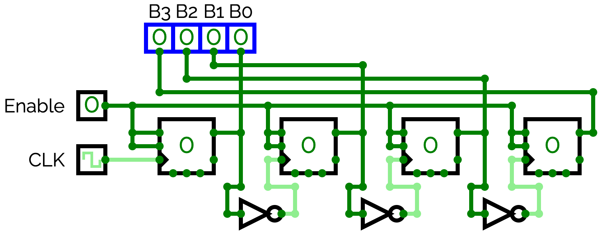

#### Timing Diagram — 4-bit Ripple Up Counter (t0–t8)

```
         t0   t1   t2   t3   t4   t5   t6   t7   t8
              ↓    ↓    ↓    ↓    ↓    ↓    ↓    ↓
CLK:   ‾‾‾‾‾|____|‾‾‾‾|____|‾‾‾‾|____|‾‾‾‾|____|‾‾‾‾|____

Q₀:    _____|‾‾‾‾|____|‾‾‾‾|____|‾‾‾‾|____|‾‾‾‾|____|‾‾‾‾

Q₁:    _____|‾‾‾‾‾‾‾‾‾|_____|‾‾‾‾‾‾‾‾‾|_____|‾‾‾‾‾‾‾‾‾|___

Q₂:    _____|‾‾‾‾‾‾‾‾‾‾‾‾‾‾‾‾‾‾‾|_____|‾‾‾‾‾‾‾‾‾‾‾‾‾‾‾‾‾‾‾

Q₃:    _______________________________________________|‾‾‾‾
                                          (เปลี่ยนที่ t8)
```

| ช่วง | t0 | t1↓ | t2↓ | t3↓ | t4↓ | t5↓ | t6↓ | t7↓ | t8↓ |
|:---:|:---:|:---:|:---:|:---:|:---:|:---:|:---:|:---:|:---:|
| Q₃ | 0 | 0 | 0 | 0 | 0 | 0 | 0 | 0 | **1** |
| Q₂ | 0 | 0 | 0 | 0 | 1 | 1 | 1 | 1 | **0** |
| Q₁ | 0 | 0 | 1 | 1 | 0 | 0 | 1 | 1 | **0** |
| Q₀ | 0 | 1 | 0 | 1 | 0 | 1 | 0 | 1 | **0** |
| **Count** | **0** | **1** | **2** | **3** | **4** | **5** | **6** | **7** | **8** |

> 💡 Q₃ เริ่มเปลี่ยนสถานะหลังจาก **8 Clock** — ครบ 16 cycles จึงวนกลับ 0 (MOD-16)

---

### 4-bit Ripple Down Counter

- เชื่อม **Q̄ (complement)** ของ FF แต่ละตัวเป็น Clock ของ FF ตัวถัดไป
- Q₁ Toggle ที่ **Positive Edge ของ Q₀** (= Negative Edge ของ Q̄₀)
- Q₂ Toggle ที่ **Positive Edge ของ Q₁**, Q₃ ที่ **Positive Edge ของ Q₂**
- นับ 15 → 14 → 13 → … → 0 → 15

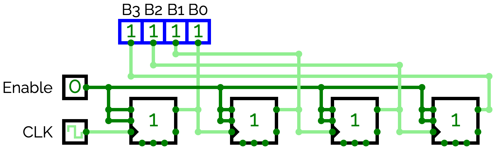

#### Timing Diagram — 4-bit Ripple Down Counter (เริ่มจาก 1111)

```
         t0   t1   t2   t3   t4   t5   t6   t7   t8
              ↓    ↓    ↓    ↓    ↓    ↓    ↓    ↓
CLK:   ‾‾‾‾‾|____|‾‾‾‾|____|‾‾‾‾|____|‾‾‾‾|____|‾‾‾‾|____

Q₀:    ‾‾‾‾‾|____|‾‾‾‾|____|‾‾‾‾|____|‾‾‾‾|____|‾‾‾‾|____

Q₁:    ‾‾‾‾‾‾‾‾‾|_____|‾‾‾‾‾‾‾‾‾|_____|‾‾‾‾‾‾‾‾‾|_________
                 ↑           ↑           ↑
           Toggle ที่ Rising Edge ของ Q₀

Q₂:    ‾‾‾‾‾‾‾‾‾‾‾‾‾‾‾‾‾‾‾|_____|‾‾‾‾‾‾‾‾‾‾‾‾‾‾‾‾‾‾‾|_____
                                 ↑
                           Toggle ที่ Rising Edge ของ Q₁

Q₃:    ‾‾‾‾‾‾‾‾‾‾‾‾‾‾‾‾‾‾‾‾‾‾‾‾‾‾‾‾‾‾‾‾‾‾‾‾‾‾‾‾‾|_________
                                                 ↑
                                           Toggle ที่ Rising Edge ของ Q₂
```

| ช่วง | t0 | t1↓ | t2↓ | t3↓ | t4↓ | t5↓ | t6↓ | t7↓ | t8↓ |
|:---:|:---:|:---:|:---:|:---:|:---:|:---:|:---:|:---:|:---:|
| Q₃ | 1 | 1 | 1 | 1 | 1 | 1 | 1 | 1 | **0** |
| Q₂ | 1 | 1 | 1 | 1 | **0** | 0 | 0 | 0 | **1** |
| Q₁ | 1 | 1 | **0** | 0 | **1** | 1 | **0** | 0 | **1** |
| Q₀ | 1 | **0** | **1** | **0** | **1** | **0** | **1** | **0** | **1** |
| **Count** | **15** | **14** | **13** | **12** | **11** | **10** | **9** | **8** | **7** |

- Q₁ Toggle ที่ **Rising Edge ของ Q₀** (t2, t4, t6, t8)
- Q₂ Toggle ที่ **Rising Edge ของ Q₁** (t4, t8)
- Q₃ Toggle ที่ **Rising Edge ของ Q₂** (t8)
- ต่อเนื่อง: 7 → 6 → … → 0 → 15 → 14 → …


## 7.3 MOD-10 Decade Counter (นับ 0–9)

นับ **0 → 1 → 2 → … → 9 → 0** วนซ้ำ — ใช้ 4 FF (Q₃Q₂Q₁Q₀) พร้อมวงจร Reset อัตโนมัติ

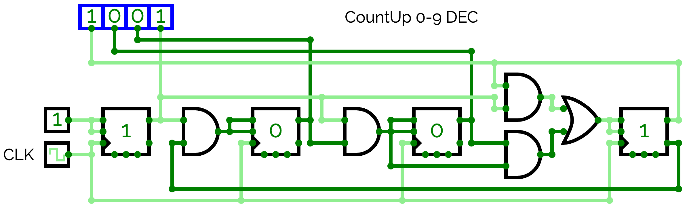

### หลักการ

- นับแบบ Binary ปกติจนถึง **9 (1001₂)**
- Clock ถัดไป → เกิดสถานะ **10 (1010₂)** ชั่วขณะ
- **NAND(Q₃, Q₁)** ตรวจจับ 1010₂ → ส่ง CLR ทุก FF กลับ **0** ทันที
- วนกลับนับใหม่ตั้งแต่ 0

### Timing Diagram — MOD-10 Decade Counter

```
         t0   t1   t2   t3   t4   t5   t6   t7   t8   t9   t10
              ↓    ↓    ↓    ↓    ↓    ↓    ↓    ↓    ↓    ↓
CLK:   ‾‾‾‾‾|____|‾‾‾‾|____|‾‾‾‾|____|‾‾‾‾|____|‾‾‾‾|____|‾‾‾‾|____

Q₀:    _____|‾‾‾‾|____|‾‾‾‾|____|‾‾‾‾|____|‾‾‾‾|____|★___|‾‾‾‾|____

Q₁:    _____|‾‾‾‾‾‾‾‾‾|_____|‾‾‾‾‾‾‾‾‾|_____|‾‾‾‾‾‾‾‾‾|★___|_____|‾‾

Q₂:    _____|‾‾‾‾‾‾‾‾‾‾‾‾‾‾‾‾‾‾‾|_____|‾‾‾‾‾‾‾‾‾‾‾‾‾‾‾‾‾‾‾|★__|____

Q₃:    _______________________________________________|‾‾‾‾|★___|____
                                                              ↑
                                                       Reset (1010→0)
```

| ช่วง | t0 | t1↓ | t2↓ | t3↓ | t4↓ | t5↓ | t6↓ | t7↓ | t8↓ | t9↓ | t10↓ |
|:---:|:---:|:---:|:---:|:---:|:---:|:---:|:---:|:---:|:---:|:---:|:---:|
| Q₃ | 0 | 0 | 0 | 0 | 0 | 0 | 0 | 0 | 1 | 1 | **0** |
| Q₂ | 0 | 0 | 0 | 0 | 1 | 1 | 1 | 1 | 0 | 0 | **0** |
| Q₁ | 0 | 0 | 1 | 1 | 0 | 0 | 1 | 1 | 0 | 0 | **0** |
| Q₀ | 0 | 1 | 0 | 1 | 0 | 1 | 0 | 1 | 0 | 1 | **0** |
| **Dec** | **0** | **1** | **2** | **3** | **4** | **5** | **6** | **7** | **8** | **9** | **Reset→0** |

> ★ = **Glitch / Transient State** — สถานะ 1010 (=10) เกิดขึ้น **ชั่วขณะ** ก่อนที่ NAND gate จะตรวจจับและส่ง CLR=0 ให้ทุก FF รีเซตกลับ 0 ทันที (ไม่ใช่ Clock edge ปกติ)

### วงจร Reset

```
Q₃ ──┐
     ├── NAND ──► CLR (Active Low) ──► ทุก FF
Q₁ ──┘

เมื่อ Q₃=1 และ Q₁=1 (= เลข 10) → NAND output = 0 → CLR ทุก FF
```

> ⚠️ สถานะ 10 (1010₂) เกิดขึ้น **ชั่วขณะ** ก่อน Reset — อาจเกิด glitch สั้น ๆ

### State Table — MOD-10

| Q₃Q₂Q₁Q₀ | Decimal | Q₃Q₂Q₁Q₀ (ถัดไป) |
|:---:|:---:|:---:|
| 0000 | 0 | 0001 |
| 0001 | 1 | 0010 |
| 0010 | 2 | 0011 |
| 0011 | 3 | 0100 |
| 0100 | 4 | 0101 |
| 0101 | 5 | 0110 |
| 0110 | 6 | 0111 |
| 0111 | 7 | 1000 |
| 1000 | 8 | 1001 |
| 1001 | 9 | **0000** (Reset) |

**IC: 7490** (Async Decade Counter MOD-10) — **IC: 74160 / 74162** (Sync Decade Counter)

---

## 7.4 Synchronous Counter ⭐

### หลักการ

- **Clock เดียวกัน** ป้อนให้ FF ทุกตัวพร้อมกัน → ไม่มี delay สะสม
- ใช้ Combinational Logic ควบคุม J, K ของแต่ละ FF
- **เร็วกว่า** Ripple Counter และ **ไม่มี Glitch**

### ขั้นตอนการออกแบบ

```
  1. กำหนด State Diagram   →   ลำดับการนับ
          ↓
  2. สร้าง State Table      →   Q(now) → Q(next)
          ↓
  3. เลือกชนิด FF           →   D FF หรือ JK FF
          ↓
  4. ใช้ Excitation Table   →   หา J, K (หรือ D) จาก Q→Q+
          ↓
  5. K-Map ลดรูป           →   สมการอินพุตของแต่ละ FF
          ↓
  6. วาดวงจร
```

### ตัวอย่าง: 3-bit Synchronous Up Counter (JK FF)

**State Table + Excitation:**

| Q₂ | Q₁ | Q₀ | Q₂⁺ | Q₁⁺ | Q₀⁺ | J₂ | K₂ | J₁ | K₁ | J₀ | K₀ |
|:---:|:---:|:---:|:---:|:---:|:---:|:---:|:---:|:---:|:---:|:---:|:---:|
| 0 | 0 | 0 | 0 | 0 | 1 | 0 | X | 0 | X | 1 | X |
| 0 | 0 | 1 | 0 | 1 | 0 | 0 | X | 1 | X | X | 1 |
| 0 | 1 | 0 | 0 | 1 | 1 | 0 | X | X | 0 | 1 | X |
| 0 | 1 | 1 | 1 | 0 | 0 | 1 | X | X | 1 | X | 1 |
| 1 | 0 | 0 | 1 | 0 | 1 | X | 0 | 0 | X | 1 | X |
| 1 | 0 | 1 | 1 | 1 | 0 | X | 0 | 1 | X | X | 1 |
| 1 | 1 | 0 | 1 | 1 | 1 | X | 0 | X | 0 | 1 | X |
| 1 | 1 | 1 | 0 | 0 | 0 | X | 1 | X | 1 | X | 1 |

**ผลลัพธ์ K-Map:**

$$J_0 = K_0 = 1$$
$$J_1 = K_1 = Q_0$$
$$J_2 = K_2 = Q_0 \cdot Q_1$$

#### Timing Diagram — 3-bit Synchronous Up Counter

```
         t0   t1   t2   t3   t4   t5   t6   t7   t8
              ↓    ↓    ↓    ↓    ↓    ↓    ↓    ↓
CLK:   ‾‾‾‾‾|____|‾‾‾‾|____|‾‾‾‾|____|‾‾‾‾|____|‾‾‾‾|____

Q₀:    _____|‾‾‾‾|____|‾‾‾‾|____|‾‾‾‾|____|‾‾‾‾|____|‾‾‾‾

Q₁:    _____|‾‾‾‾‾‾‾‾‾|_____|‾‾‾‾‾‾‾‾‾|_____|‾‾‾‾‾‾‾‾‾|___

Q₂:    _____|‾‾‾‾‾‾‾‾‾‾‾‾‾‾‾‾‾‾‾|_____|‾‾‾‾‾‾‾‾‾‾‾‾‾‾‾‾‾‾‾
```

| ช่วง | t0 | t1↓ | t2↓ | t3↓ | t4↓ | t5↓ | t6↓ | t7↓ | t8↓ |
|:---:|:---:|:---:|:---:|:---:|:---:|:---:|:---:|:---:|:---:|
| Q₂ | 0 | 0 | 0 | 0 | 1 | 1 | 1 | 1 | **0** |
| Q₁ | 0 | 0 | 1 | 1 | 0 | 0 | 1 | 1 | **0** |
| Q₀ | 0 | 1 | 0 | 1 | 0 | 1 | 0 | 1 | **0** |
| **Count** | **0** | **1** | **2** | **3** | **4** | **5** | **6** | **7** | **0** |

> 💡 ทุก FF เปลี่ยนสถานะ **พร้อมกัน** ที่ขอบ Clock → ไม่มี Propagation Delay สะสม

---

### 4-bit Synchronous Up Counter (MOD-16)

เพิ่ม **FF₃ (Q₃)** จาก 3-bit — สมการ J, K ขยายตาม pattern เดิม:

$$J_0 = K_0 = 1$$
$$J_1 = K_1 = Q_0$$
$$J_2 = K_2 = Q_0 \cdot Q_1$$
$$J_3 = K_3 = Q_0 \cdot Q_1 \cdot Q_2$$

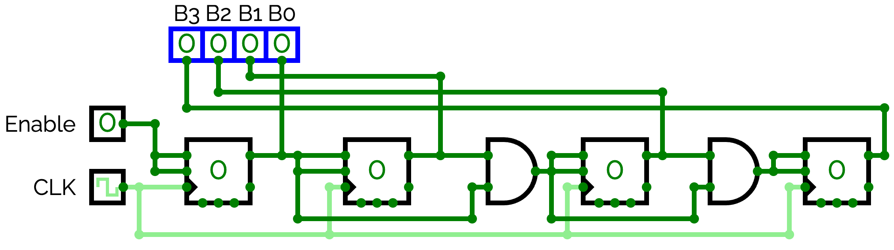

#### Timing Diagram — 4-bit Synchronous Up Counter (t0–t8)

```
         t0   t1   t2   t3   t4   t5   t6   t7   t8
              ↑    ↑    ↑    ↑    ↑    ↑    ↑    ↑
CLK:   _____|‾‾‾‾|____|‾‾‾‾|____|‾‾‾‾|____|‾‾‾‾|____|‾‾‾‾

Q₀:    _____|‾‾‾‾|____|‾‾‾‾|____|‾‾‾‾|____|‾‾‾‾|____|‾‾‾‾

Q₁:    _____|‾‾‾‾‾‾‾‾‾|_____|‾‾‾‾‾‾‾‾‾|_____|‾‾‾‾‾‾‾‾‾|___

Q₂:    _____|‾‾‾‾‾‾‾‾‾‾‾‾‾‾‾‾‾‾‾|_____|‾‾‾‾‾‾‾‾‾‾‾‾‾‾‾‾‾‾‾

Q₃:    ‾‾‾‾‾‾‾‾‾‾‾‾‾‾‾‾‾‾‾‾‾‾‾‾‾‾‾‾‾‾‾‾‾‾‾‾‾‾‾‾‾|_________
                                                 (เปลี่ยน t8)
```

| ช่วง | t0 | t1↑ | t2↑ | t3↑ | t4↑ | t5↑ | t6↑ | t7↑ | t8↑ |
|:---:|:---:|:---:|:---:|:---:|:---:|:---:|:---:|:---:|:---:|
| Q₃ | 1 | 1 | 1 | 1 | 1 | 1 | 1 | 1 | **0** |
| Q₂ | 1 | 1 | 1 | 1 | **0** | 0 | 0 | 0 | **1** |
| Q₁ | 1 | 1 | **0** | 0 | **1** | 1 | **0** | 0 | **1** |
| Q₀ | 1 | **0** | **1** | **0** | **1** | **0** | **1** | **0** | **1** |
| **Count** | **15** | **16→0** | **1** | **2** | **3** | **4** | **5** | **6** | **7** |

> ⚠️ แสดงช่วง t0=15 → reset → นับต่อ (เพื่อให้เห็นสถานะวนกลับ)

**State Table บางส่วน:**

| Q₃ | Q₂ | Q₁ | Q₀ | Q₃⁺ | Q₂⁺ | Q₁⁺ | Q₀⁺ | J₃K₃ | J₂K₂ | J₁K₁ | J₀K₀ |
|:---:|:---:|:---:|:---:|:---:|:---:|:---:|:---:|:---:|:---:|:---:|:---:|
| 0 | 0 | 0 | 0 | 0 | 0 | 0 | 1 | 0X | 0X | 0X | 1X |
| 0 | 0 | 0 | 1 | 0 | 0 | 1 | 0 | 0X | 0X | 1X | X1 |
| 0 | 0 | 1 | 0 | 0 | 0 | 1 | 1 | 0X | 0X | X0 | 1X |
| 0 | 0 | 1 | 1 | 0 | 1 | 0 | 0 | 0X | 1X | X1 | X1 |
| 0 | 1 | 1 | 1 | 1 | 0 | 0 | 0 | 1X | X1 | X1 | X1 |
| 1 | 1 | 1 | 1 | 0 | 0 | 0 | 0 | X1 | X1 | X1 | X1 |

---

### 4-bit Synchronous Down Counter

นับลง 15→14→13→…→0→15 — เปลี่ยน J, K ให้ toggle เมื่อบิตที่ต่ำกว่าทั้งหมด **= 0**:

$$J_0 = K_0 = 1$$
$$J_1 = K_1 = \overline{Q_0}$$
$$J_2 = K_2 = \overline{Q_0} \cdot \overline{Q_1}$$
$$J_3 = K_3 = \overline{Q_0} \cdot \overline{Q_1} \cdot \overline{Q_2}$$

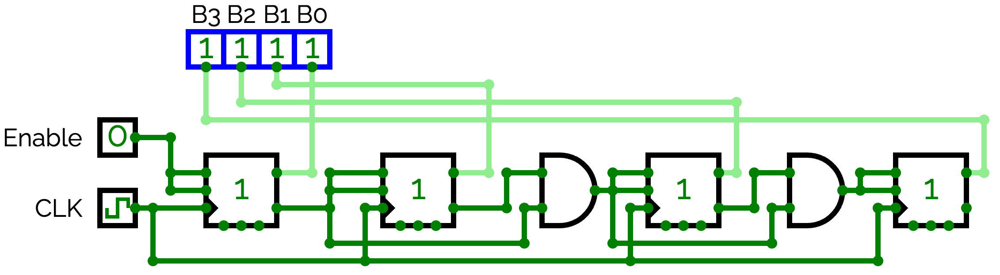

#### Timing Diagram — 4-bit Synchronous Down Counter (เริ่มจาก 0000)

```
         t0   t1   t2   t3   t4   t5   t6   t7   t8
              ↑    ↑    ↑    ↑    ↑    ↑    ↑    ↑
CLK:   _____|‾‾‾‾|____|‾‾‾‾|____|‾‾‾‾|____|‾‾‾‾|____|‾‾‾‾

Q₀:    _____|‾‾‾‾|____|‾‾‾‾|____|‾‾‾‾|____|‾‾‾‾|____|‾‾‾‾

Q₁:    ‾‾‾‾‾‾‾‾‾|_____|‾‾‾‾‾‾‾‾‾|_____|‾‾‾‾‾‾‾‾‾|_________

Q₂:    ‾‾‾‾‾‾‾‾‾‾‾‾‾‾‾‾‾‾‾|_____|‾‾‾‾‾‾‾‾‾‾‾‾‾‾‾‾‾‾‾|_____

Q₃:    ‾‾‾‾‾‾‾‾‾‾‾‾‾‾‾‾‾‾‾‾‾‾‾‾‾‾‾‾‾‾‾‾‾‾‾‾‾‾‾|___________
```

| ช่วง | t0 | t1↑ | t2↑ | t3↑ | t4↑ | t5↑ | t6↑ | t7↑ | t8↑ |
|:---:|:---:|:---:|:---:|:---:|:---:|:---:|:---:|:---:|:---:|
| Q₃ | 0 | 0 | 0 | 0 | 0 | 0 | 0 | 0 | **1** |
| Q₂ | 0 | 0 | 0 | 0 | **1** | 1 | 1 | 1 | **0** |
| Q₁ | 0 | 0 | **1** | 1 | **0** | 0 | **1** | 1 | **0** |
| Q₀ | 0 | **1** | **0** | **1** | **0** | **1** | **0** | **1** | **0** |
| **Count** | **0** | **15** | **14** | **13** | **12** | **11** | **10** | **9** | **8** |

- t1↑: Q₀→1, Q₁→1, Q₂→1, Q₃→1 พร้อมกัน (เหตุ: J₃K₃ = Q̄₀·Q̄₁·Q̄₂=1 เพราะทุกตัว=0)
- ตัวนับวนลง: 0 → 15 → 14 → 13 → …

**เปรียบเทียบ Up vs Down (Synchronous 4-bit):**

| | Synchronous Up Counter | Synchronous Down Counter |
|:---|:---|:---|
| **สมการ J₁** | J₁ = K₁ = Q₀ | J₁ = K₁ = Q̄₀ |
| **สมการ J₂** | J₂ = K₂ = Q₀·Q₁ | J₂ = K₂ = Q̄₀·Q̄₁ |
| **สมการ J₃** | J₃ = K₃ = Q₀·Q₁·Q₂ | J₃ = K₃ = Q̄₀·Q̄₁·Q̄₂ |
| **Toggle เมื่อ** | บิตที่ต่ำกว่าทั้งหมด = **1** | บิตที่ต่ำกว่าทั้งหมด = **0** |
| **ลำดับ** | 0→1→2→…→15→0 | 0→15→14→…→1→0 |


---

## 7.5 เปรียบเทียบ Async vs Sync Counter

| เกณฑ์ | Asynchronous (Ripple) | Synchronous |
|:---|:---:|:---:|
| Clock | ป้อนแค่ FF ตัวแรก | ป้อนทุก FF ✅ |
| ความเร็ว | ช้า (delay สะสม) ⚠️ | เร็ว ✅ |
| Glitch | อาจเกิด ⚠️ | ไม่มี ✅ |
| ความซับซ้อนวงจร | ง่าย ✅ | ซับซ้อนกว่า |
| การออกแบบ | ง่าย ✅ | ต้องใช้ K-Map |
| ใช้ในระบบ | ความถี่ต่ำ | **ความถี่สูง** ✅ |

---

## 7.6 Up/Down Counter

เพิ่มสัญญาณ **UP/DOWN** เพื่อเลือกทิศทางการนับ

| UP/DOWN | การทำงาน |
|:---:|:---|
| 1 | นับขึ้น (0→1→2→…→N-1→0) |
| 0 | นับลง (N-1→…→2→1→0→N-1) |

#### Timing Diagram — 2-bit Up/Down Counter

```
         t0   t1   t2   t3   t4   t5   t6   t7
              ↑    ↑    ↑    ↑    ↑    ↑    ↑
CLK:   _____|‾‾‾‾|____|‾‾‾‾|____|‾‾‾‾|____|‾‾‾‾|____

UP:    ‾‾‾‾‾‾‾‾‾‾‾‾‾‾‾‾‾‾‾‾‾|_______________________
       (นับขึ้น)                (นับลง)

Q₁:    _____|‾‾‾‾‾‾‾‾‾|_____|‾‾‾‾‾‾‾‾‾|_______________

Q₀:    _____|‾‾‾‾|____|‾‾‾‾|____|‾‾‾‾|____|‾‾‾‾|_______
```

| ช่วง | t0 | t1↑ | t2↑ | t3↑ | t4↑ | t5↑ | t6↑ | t7↑ |
|:---:|:---:|:---:|:---:|:---:|:---:|:---:|:---:|:---:|
| UP | 1 | 1 | 1 | 1 | **0** | 0 | 0 | 0 |
| Q₁ | 0 | 0 | 1 | 1 | 1 | 1 | 0 | 0 |
| Q₀ | 0 | 1 | 0 | 1 | 0 | 1 | 0 | 1 |
| **Count** | **0** | **1** | **2** | **3** | **2** | **3** | **2** | **1** |
| ทิศทาง | ↑ | ↑ | ↑ | ↑ | **↓** | ↓ | ↓ | ↓ |

**IC: 74190** (Sync BCD Up/Down) — **IC: 74191** (Sync Binary Up/Down)

---

## 7.7 Ring Counter

### หลักการ

- ต่อ Q output ของ FF ตัวสุดท้าย กลับเข้า D input ของ FF ตัวแรก
- มีบิต '1' เพียง **1 ตัว** วิ่งวนไปตลอด
- **n FF → MOD-n** (มี n สถานะ)

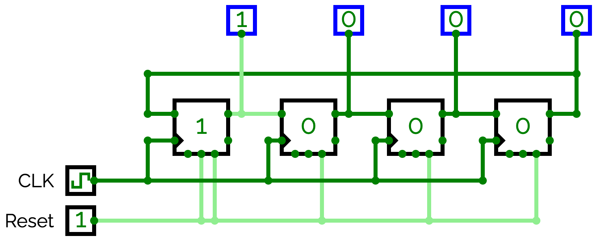

#### Timing Diagram — 4-bit Ring Counter

```
         t0   t1   t2   t3   t4   t5
              ↑    ↑    ↑    ↑    ↑
CLK:   _____|‾‾‾‾|____|‾‾‾‾|____|‾‾‾‾|____

Q₃:    ‾‾‾‾‾|____________________________|‾‾
       (1)        (0)   (0)   (0)   (1 วนกลับ)

Q₂:    _____|‾‾‾‾|_________________________

Q₁:    _____|‾‾‾‾‾‾‾‾‾|_________________

Q₀:    _____|‾‾‾‾‾‾‾‾‾‾‾‾‾|____________
```

| ช่วง | เริ่มต้น | t1↑ | t2↑ | t3↑ | t4↑ |
|:---:|:---:|:---:|:---:|:---:|:---:|
| Q₃ | **1** | 0 | 0 | 0 | **1** |
| Q₂ | 0 | **1** | 0 | 0 | 0 |
| Q₁ | 0 | 0 | **1** | 0 | 0 |
| Q₀ | 0 | 0 | 0 | **1** | 0 |

- บิต '1' เลื่อนไปทางขวา 1 ตำแหน่งทุก Clock
- ที่ t4 → วนกลับมาที่ Q₃

> ⚠️ ต้องมีวงจร **Initialize** บังคับให้ Q₃=1 ตอนเริ่มต้น (ใช้ Preset)
> ถ้า all-zero state จะหยุดนิ่งตลอดกาล


## 7.8 Johnson Counter (Twisted Ring Counter)

### หลักการ

- ต่อ **Q̄ ของ FF ตัวสุดท้าย** กลับเข้า D ของ FF ตัวแรก (เหมือน Ring แต่ invert)
- **n FF → MOD-2n** (มีสถานะมากกว่า Ring Counter 2 เท่า)
- ถอดรหัส (Decode) ง่าย — ใช้แค่ 2-input gate

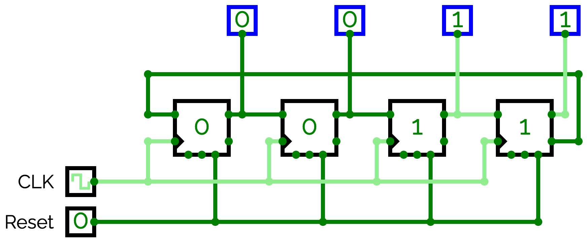

#### Timing Diagram — 4-bit Johnson Counter (MOD-8)

```
         t0   t1   t2   t3   t4   t5   t6   t7   t8
              ↑    ↑    ↑    ↑    ↑    ↑    ↑    ↑
CLK:   _____|‾‾‾‾|____|‾‾‾‾|____|‾‾‾‾|____|‾‾‾‾|____|‾‾‾‾

Q₃:    _____|‾‾‾‾‾‾‾‾‾‾‾‾‾‾‾‾‾‾‾‾‾‾‾‾‾|___________________

Q₂:    _____|‾‾‾‾‾‾‾‾‾‾‾‾‾‾‾‾‾‾‾‾‾|_______________________

Q₁:    _____|‾‾‾‾‾‾‾‾‾‾‾‾‾‾‾|___________________________

Q₀:    _____|‾‾‾‾‾‾‾‾‾|_________________________________
```

| ช่วง | t0 | t1↑ | t2↑ | t3↑ | t4↑ | t5↑ | t6↑ | t7↑ | t8↑ |
|:---:|:---:|:---:|:---:|:---:|:---:|:---:|:---:|:---:|:---:|
| Q₃ | 0 | **1** | 1 | 1 | 1 | **0** | 0 | 0 | 0 |
| Q₂ | 0 | 0 | **1** | 1 | 1 | 1 | **0** | 0 | 0 |
| Q₁ | 0 | 0 | 0 | **1** | 1 | 1 | 1 | **0** | 0 |
| Q₀ | 0 | 0 | 0 | 0 | **1** | 1 | 1 | 1 | **0** |
| **State** | 0000 | 1000 | 1100 | 1110 | 1111 | 0111 | 0011 | 0001 | 0000 |

- t0–t3: เติม '1' เข้ามาจาก MSB
- t4–t7: เติม '0' เข้ามา → วนกลับ

**การ Decode (ใช้ 2-input gate):**

| สถานะ | Decode |
|:---:|:---:|
| 0000 | Q̄₃ · Q̄₀ |
| 1000 | Q₃ · Q̄₂ |
| 1111 | Q₃ · Q₀ |
| 0001 | Q̄₃ · Q₀ |

> 💡 **เปรียบเทียบ Ring vs Johnson (4-bit):**
> - Ring = MOD-4 (4 สถานะ)
> - Johnson = **MOD-8** (8 สถานะ) — ใช้ FF น้อยกว่า Binary Counter

---

# ส่วนที่ 2: รีจิสเตอร์ (Registers)

Register คือกลุ่ม Flip-Flop ที่เก็บข้อมูลหลายบิต แบ่งตามลักษณะ Input/Output:

| ประเภท | Input | Output | IC |
|:---|:---:|:---:|:---:|
| **SISO** | Serial | Serial | — |
| **SIPO** | Serial | Parallel | 74164 |
| **PISO** | Parallel | Serial | 74165 |
| **PIPO** | Parallel | Parallel | 74374 |
| **Universal** | Serial/Parallel | Serial/Parallel | **74194** |

---

## 7.8.1 Linear Feedback Shift Register (LFSR)

เป็น Shift Register รูปแบบพิเศษที่ใช้ XOR นำสัญญาณจากบางบิตกลับมาเป็น Input
- ทำให้ได้ลำดับตัวเลขเอาต์พุตที่มีลักษณะ **เสมือนสุ่ม (Pseudo-Random)**
- มีความยาวรอบซ้ำสูงสุดคือ $2^n - 1$
- **การใช้งาน:** เครื่องกำเนิดเลขสุ่ม (PRNG), การเข้ารหัสข้อมูล (Cryptography), การสร้างสัญญาณทดสอบ (Built-in Self Test)

## 7.8.2 Clock Divider (Prescaler)

การใช้ Flip-Flop หรือ Counter มาหารความถี่ Clock หลักให้ต่ำลง เช่น Clock 50MHz หารด้วย 50,000,000 จะได้ 1Hz (1 วินาทีพอดี) ใช้ในการสร้างสัญญาณ Timer หรือควบคุมการแสดงผลที่สายตามนุษย์มองทัน

## 7.9 SISO — Serial-In Serial-Out

ข้อมูลเข้าทีละ 1 บิต และออกทีละ 1 บิต — ทำหน้าที่เป็น **Time Delay (n clock cycles)**

### หลักการ

- D FF ต่ออนุกรม: SOUT ของ FF แต่ละตัว → DIN ของ FF ถัดไป
- ข้อมูลใช้เวลา **n clock** จึงปรากฏที่ output (n = จำนวน FF)

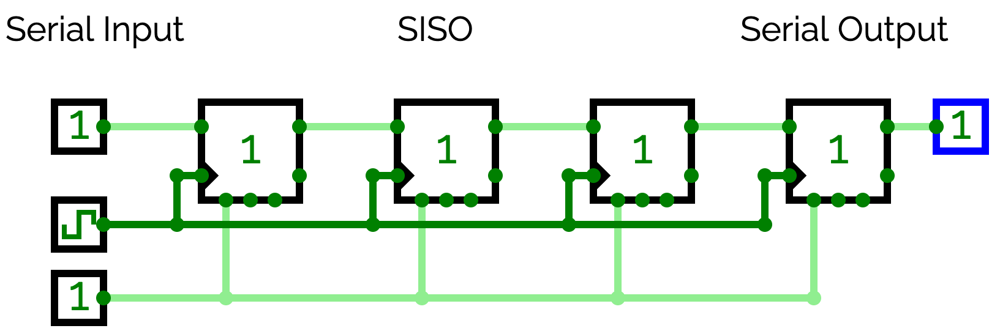

#### Timing Diagram — SISO 4-bit (หน่วง 4 clock)

```
         t0   t1   t2   t3   t4   t5   t6   t7
              ↑    ↑    ↑    ↑    ↑    ↑    ↑
CLK:   _____|‾‾‾‾|____|‾‾‾‾|____|‾‾‾‾|____|‾‾‾‾|____

SIN:   _____|‾‾‾‾|‾‾‾‾|____|‾‾‾‾|____________________
       (0)  (1)  (1)  (0)  (1)

Q₃:    _____|‾‾‾‾|‾‾‾‾|____|‾‾‾‾|____________________

Q₂:    ___________|‾‾‾‾|‾‾‾‾|____|‾‾‾‾|______________

Q₁:    _______________|‾‾‾‾|‾‾‾‾|____|‾‾‾‾|__________

SOUT:  ___________________|‾‾‾‾|‾‾‾‾|____|‾‾‾‾|______
       (หน่วงออกมา 4 clock)
```

| ช่วง | SIN | Q₃ | Q₂ | Q₁ | SOUT | หมายเหตุ |
|:---:|:---:|:---:|:---:|:---:|:---:|:---|
| เริ่มต้น | — | 0 | 0 | 0 | 0 | |
| t1↑ | **1** | **1** | 0 | 0 | 0 | บิตเข้า FF₃ |
| t2↑ | **1** | **1** | **1** | 0 | 0 | เลื่อนขวา |
| t3↑ | **0** | **0** | **1** | **1** | 0 | เลื่อนขวา |
| t4↑ | **1** | **1** | **0** | **1** | **1** | **บิตแรกออก** (delay 4 clock) |
| t5↑ | 0 | **0** | **1** | **0** | **1** | |

- ข้อมูลที่ SOUT = ข้อมูลที่ SIN เมื่อ **4 clock ก่อนหน้า**
- ใช้งาน: delay line, pipeline, synchronizer

---

## 7.10 SIPO — Serial-In Parallel-Out

ข้อมูลเข้าทีละ 1 บิต (Serial) → อ่านออกพร้อมกันทุกบิต (Parallel) — ใช้รับข้อมูลจาก Serial bus

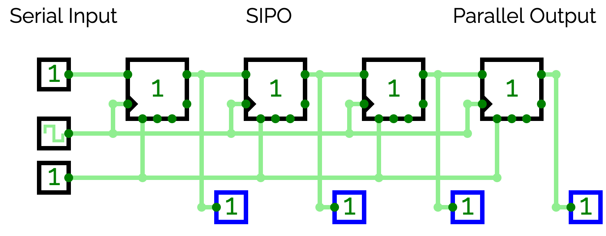

#### Timing Diagram — SIPO 4-bit (รับข้อมูล 1011)

```
         t0   t1   t2   t3   t4
              ↑    ↑    ↑    ↑
CLK:   _____|‾‾‾‾|____|‾‾‾‾|____|‾‾‾‾

SIN:   ‾‾‾‾‾|____|‾‾‾‾|‾‾‾‾|____|
       (1)   (0)  (1)  (1)
         ↑                   ↑
        MSB                 LSB

Q₃:    _____|‾‾‾‾|____|‾‾‾‾|‾‾‾‾|

Q₂:    ___________|‾‾‾‾|____|‾‾‾‾

Q₁:    _______________|‾‾‾‾|____|‾

Q₀:    ________________________|‾‾
```

| ช่วง | SIN | Q₃ | Q₂ | Q₁ | Q₀ | หมายเหตุ |
|:---:|:---:|:---:|:---:|:---:|:---:|:---|
| เริ่มต้น | — | 0 | 0 | 0 | 0 | ทุก FF = 0 |
| t1↑ | **1** | **1** | 0 | 0 | 0 | MSB เข้า Q₃ |
| t2↑ | **0** | **0** | **1** | 0 | 0 | เลื่อนขวา |
| t3↑ | **1** | **1** | **0** | **1** | 0 | เลื่อนขวา |
| t4↑ | **1** | **1** | **1** | **0** | **1** | **Q₃Q₂Q₁Q₀ = 1011 ครบ!** |

- อ่าน Parallel Output (Q₃Q₂Q₁Q₀) พร้อมกันได้ที่ t4
- **IC: 74164** (8-bit SIPO)

---

## 7.11 PISO — Parallel-In Serial-Out

โหลดข้อมูลทุกบิตพร้อมกัน (Parallel) แล้วส่งออกทีละบิต (Serial) — ใช้ส่งข้อมูลผ่าน Serial line

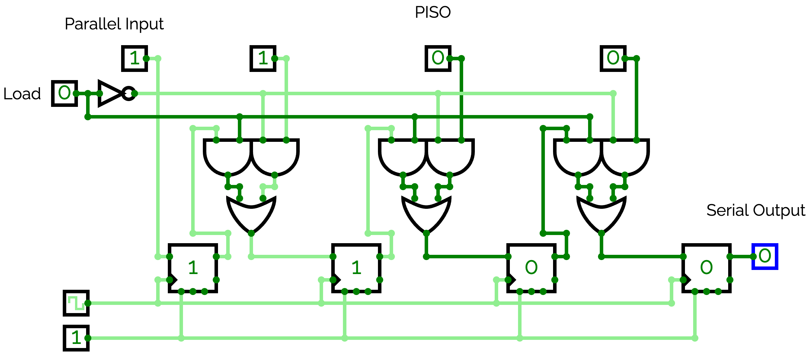

#### Timing Diagram — PISO 4-bit (ส่งข้อมูล 1101)

```
         t0   t1   t2   t3   t4   t5
              ↑    ↑    ↑    ↑    ↑
CLK:   _____|‾‾‾‾|____|‾‾‾‾|____|‾‾‾‾|____

LOAD:  ‾‾‾‾‾|____|‾‾‾‾‾‾‾‾‾‾‾‾‾‾‾‾‾‾‾‾‾‾
       (LOAD=1: โหลด parallel data ที่ t1↑)

SOUT:  ______|‾‾‾‾|____|‾‾‾‾|‾‾‾‾|___
              (1)  (1)  (0)  (1)
              ↑              ↑
             MSB            LSB
```

| ช่วง | การทำงาน | SOUT | หมายเหตุ |
|:---:|:---|:---:|:---|
| t1↑ | LOAD=1 → โหลด 1101 เข้า FF ทุกตัว | — | Parallel Load |
| t2↑ | Shift Right → ส่ง Q₃ ออก | **1** | MSB ออกก่อน |
| t3↑ | Shift Right → ส่ง Q₂ ออก | **1** | |
| t4↑ | Shift Right → ส่ง Q₁ ออก | **0** | |
| t5↑ | Shift Right → ส่ง Q₀ ออก | **1** | LSB ออกสุดท้าย |

- **IC: 74165** (8-bit PISO)

---

## 7.12 PIPO — Parallel-In Parallel-Out

โหลดข้อมูลทุกบิต **พร้อมกัน** และอ่านออกพร้อมกัน — ทำหน้าที่เป็น **Data Register / Buffer**

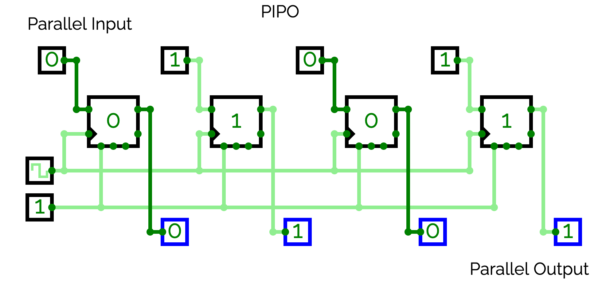

#### Timing Diagram — PIPO 4-bit

```
         t0   t1   t2   t3   t4   t5
              ↑         ↑         ↑
CLK:   _____|‾‾‾‾|____|‾‾‾‾|____|‾‾‾‾

D₃:    _____|‾‾‾‾‾‾‾‾‾|_____________

D₂:    ‾‾‾‾‾‾‾‾‾‾‾‾‾‾‾‾‾‾‾‾‾‾‾‾‾‾‾‾

D₁:    _____|‾‾‾‾‾‾‾‾‾‾‾‾‾‾‾‾‾‾‾‾‾‾

D₀:    ‾‾‾‾‾|___________________________

Q₃:    _______________|‾‾‾‾‾‾‾‾‾‾‾‾‾‾‾‾

Q₂:    ‾‾‾‾‾‾‾‾‾‾‾‾‾‾‾‾‾‾‾‾‾‾‾‾‾‾‾‾‾‾‾‾

Q₁:    _______________|‾‾‾‾‾‾‾‾‾‾‾‾‾‾‾‾

Q₀:    ‾‾‾‾‾‾‾‾‾‾‾‾‾‾‾|________________
```

| Active Edge | D₃ | D₂ | D₁ | D₀ | Q₃Q₂Q₁Q₀ | หมายเหตุ |
|:---:|:---:|:---:|:---:|:---:|:---:|:---|
| t1↑ | 1 | 1 | 1 | 0 | **1110** | จับข้อมูล 1110 |
| t3↑ | 0 | 1 | 1 | 0 | **0110** | จับข้อมูล 0110 |
| t5↑ | 0 | 1 | 1 | 0 | 0110 | Hold (D ไม่เปลี่ยน) |

- Q เปลี่ยนเฉพาะที่ **Clock Edge** — D เปลี่ยนระหว่าง Clock ก็ไม่กระทบ Q
- **IC: 74374** (Octal D FF, 3-state output), **74377** (Octal D FF with Enable)

---

## 7.13 Universal Shift Register (74194) ⭐

ทำได้ทั้ง SISO / SIPO / PISO / PIPO ในชิปเดียว — ควบคุมด้วย S₁, S₀:

| S₁ | S₀ | โหมด | การทำงาน |
|:---:|:---:|:---:|:---|
| 0 | 0 | **Hold** | Q ไม่เปลี่ยนแปลง |
| 0 | 1 | **Shift Right** | Q ← Serial Right Input (SIPO/SISO) |
| 1 | 0 | **Shift Left** | Q ← Serial Left Input |
| 1 | 1 | **Parallel Load** | Q ← D (PIPO/PISO) |

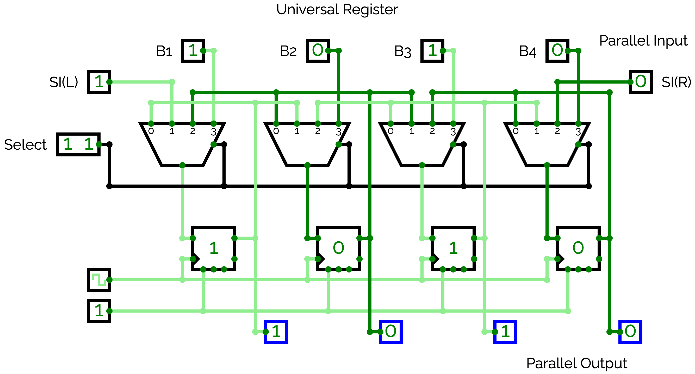

#### Timing Diagram — 74194

```
         t0   t1   t2   t3   t4   t5
              ↑    ↑    ↑    ↑    ↑
CLK:   _____|‾‾‾‾|____|‾‾‾‾|____|‾‾‾‾|____

S₁S₀:  XX   11   01   11   00   00
              ↑    ↑    ↑    ↑    ↑
            Load ShR  Load Hold Hold
```

| ช่วง | S₁S₀ | โหมด | Q₃Q₂Q₁Q₀ |
|:---:|:---:|:---:|:---:|
| เริ่มต้น | XX | — | 0000 |
| t1↑ | 11 | Parallel Load | **1010** |
| t2↑ | 01 | Shift Right | **0101** |
| t3↑ | 11 | Parallel Load | **1010** |
| t4↑ | 00 | Hold | **1010** |
| t5↑ | 00 | Hold | **1010** |

---

## 7.14 การประยุกต์ใช้ Register

| การประยุกต์ | ประเภท Register | ประโยชน์ |
|:---|:---|:---|
| **Serial ↔ Parallel** | SIPO / PISO | ลดจำนวนสายสัญญาณ |
| **Time Delay** | SISO | หน่วงสัญญาณ n clock cycles |
| **Data Buffer** | PIPO | เก็บข้อมูล 8/16/32 bit |
| **Ring Counter** | SIPO (feedback) | MOD-n ไม่ต้อง decode |
| **Johnson Counter** | SIPO (invert feedback) | MOD-2n decode ง่าย |
| **Pseudo-Random (LFSR)** | SISO + XOR feedback | ทดสอบวงจร, Encryption |
| **Arithmetic Shift** | SISO Shift 1 บิต | คูณ/หาร 2 |

---

## 7.15 สรุป IC ที่ใช้บ่อย

### IC ตัวนับ (Counter ICs)

| IC | ฟังก์ชัน | ประเภท | MOD |
|:---:|:---|:---:|:---:|
| **7490** | Decade Counter | Async | 10 |
| **7492** | Divide-by-12 Counter | Async | 12 |
| **7493** | 4-bit Binary Counter | Async | 16 |
| **74160** | Sync Decade Counter (sync clear) | Sync | 10 |
| **74161** | Sync 4-bit Counter (sync clear) | Sync | 16 |
| **74163** | Sync 4-bit Counter (fully sync) | Sync | 16 |
| **74190** | Sync BCD Up/Down Counter | Sync | 10 |
| **74191** | Sync Binary Up/Down Counter | Sync | 16 |
| **74192** | Sync BCD Up/Down (separate CLK) | Sync | 10 |

### IC รีจิสเตอร์ (Register ICs)

| IC | ฟังก์ชัน | ประเภท |
|:---:|:---|:---:|
| **74164** | 8-bit SIPO Shift Register | Shift |
| **74165** | 8-bit PISO Shift Register | Shift |
| **74166** | 8-bit PISO (sync load) | Shift |
| **74194** | 4-bit Universal Shift Register | Universal |
| **74374** | Octal D FF Register (3-state) | Parallel |
| **74377** | Octal D FF with Enable | Parallel |

---

## แบบฝึกหัดท้ายบท

1. วาด Timing Diagram ของ 3-bit Ripple Counter (Negative Edge) เป็นเวลา 10 clock cycles แสดง Q₂, Q₁, Q₀ และค่า Count
2. ออกแบบ MOD-6 Synchronous Counter โดยใช้ JK FF — ทำครบทุกขั้นตอน (State Table, Excitation, K-Map, วงจร)
3. ออกแบบ MOD-5 Counter โดยใช้ IC 7490 (วาดวงจรการต่อขา)
4. วาด Timing Diagram ของ 4-bit Johnson Counter เป็นเวลา 8 clock cycles เริ่มจาก Q=0000
5. SIPO 4-bit Shift Register จะมีค่า Q₃Q₂Q₁Q₀ เป็นอะไรหลังจากป้อน SIN = 1, 0, 1, 1, 0 ตามลำดับ (เริ่มต้น Q=0000)
6. อธิบายข้อแตกต่างระหว่าง Ring Counter และ Johnson Counter พร้อม Timing Diagram
7. ต่อวงจร MOD-10 Counter + 7-Segment Display บน **Tinkercad** โดยใช้ IC 7490 + 4511
8. ใช้ IC 74194 ต่อวงจร 4-bit Ring Counter — วาดวงจรและ Timing Diagram 4 clock cycles
