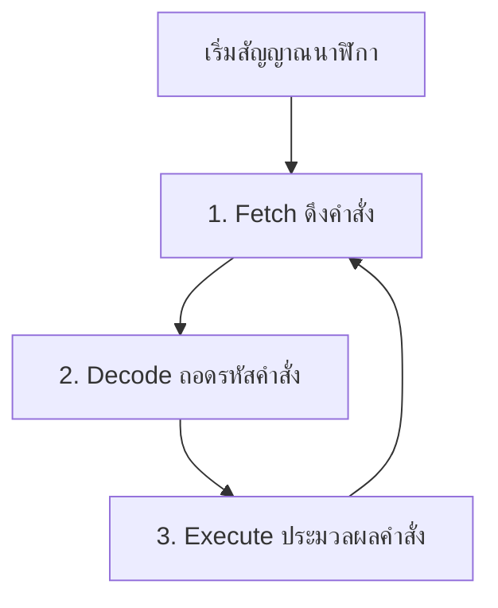

# Chapter 11: สถาปัตยกรรมคอมพิวเตอร์และหน่วยประมวลผลกลางเบื้องต้น

## Introduction to Computer Architecture & CPU Design

---

**รายวิชา:** ตรรกศาสตร์ของดิจิตอลคอมพิวเตอร์ (Digital Computer Logic)  
**หลักสูตร:** วิศวกรรมคอมพิวเตอร์ ชั้นปีที่ 1  
**บทที่:** 11 — ส่วนขยายเชิงลึก  

---

## 11.1 สถาปัตยกรรมคอมพิวเตอร์เบื้องต้น (Computer Architecture Overview)

ในการเรียนดิจิทัลลอจิกตั้งแต่บทที่ 1 ถึง 10 เราได้เรียนรู้การทำงานของเกตลอจิก วงจรคำนวณ วงจรเชิงลำดับ (Sequential Circuits) ฟลิปฟลอป และหน่วยความจำมาแล้ว ในบทนี้เราจะนำวงจรพื้นฐานเหล่านั้นมารวมกันเพื่อสร้าง **หน่วยประมวลผลกลาง (CPU)** ซึ่งเป็นหัวใจสำคัญของสถาปัตยกรรมคอมพิวเตอร์

คอมพิวเตอร์ส่วนใหญ่ในปัจจุบันใช้แนวคิดโครงสร้างแบบ **สถาปัตยกรรมฟอนนอยมันน์ (Von Neumann Architecture)** ซึ่งเสนอร่างโดย John von Neumann ในปี 1945 โดยมีหลักการสำคัญคือ **โปรแกรมและข้อมูลถูกเก็บไว้ในหน่วยความจำร่วมกัน (Shared Memory)**

### ส่วนประกอบหลักของระบบคอมพิวเตอร์ตามแนวคิด Von Neumann:
1. **CPU (Central Processing Unit):** ทำหน้าที่ประมวลผลคำสั่งตามโปรแกรม
2. **Memory (หน่วยความจำหลัก):** เก็บทั้งข้อมูล (Data) และคำสั่ง (Instructions) ของโปรแกรม
3. **Input/Output (I/O):** ช่องทางติดต่อกับอุปกรณ์ภายนอก เช่น คีย์บอร์ด จอแสดงผล
4. **System Bus:** เส้นทางเชื่อมโยงการส่งผ่านข้อมูล ประกอบด้วย Address Bus, Data Bus และ Control Bus

<svg viewBox="0 0 720 300" role="img" aria-label="สถาปัตยกรรมฟอนนอยมันน์ (Von Neumann Architecture)" style="width:100%; max-width:680px; height:auto; display:block; margin:1.25rem auto; font-family:'Segoe UI',system-ui,sans-serif;">
  <!-- Background -->
  <rect width="720" height="300" fill="#f8fafc" rx="8"/>
  
  <!-- CPU Boundary -->
  <rect x="30" y="30" width="320" height="240" rx="8" fill="#eff6ff" stroke="#2563eb" stroke-width="2" stroke-dasharray="4 4"/>
  <text x="190" y="55" text-anchor="middle" font-size="15" font-weight="700" fill="#1e40af">CPU (Central Processing Unit)</text>

  <!-- ALU -->
  <polygon points="50,90 190,90 170,140 190,190 50,190 70,140" fill="#eedffc" stroke="#9333ea" stroke-width="2"/>
  <text x="110" y="145" text-anchor="middle" font-size="14" font-weight="600" fill="#6b21a8">ALU</text>

  <!-- Control Unit -->
  <rect x="210" y="90" width="120" height="100" rx="6" fill="#ecfdf5" stroke="#059669" stroke-width="2"/>
  <text x="270" y="130" text-anchor="middle" font-size="13" font-weight="600" fill="#065f46">Control Unit</text>
  <text x="270" y="150" text-anchor="middle" font-size="13" font-weight="600" fill="#065f46">(CU)</text>

  <!-- Registers -->
  <rect x="50" y="210" width="280" height="45" rx="6" fill="#fff7ed" stroke="#ea580c" stroke-width="2"/>
  <text x="190" y="238" text-anchor="middle" font-size="13" font-weight="600" fill="#9a3412">Registers (PC, AC, IR, MAR, MDR)</text>

  <!-- Memory -->
  <rect x="490" y="30" width="180" height="110" rx="8" fill="#fef2f2" stroke="#dc2626" stroke-width="2"/>
  <text x="580" y="75" text-anchor="middle" font-size="14" font-weight="700" fill="#991b1b">Shared Memory</text>
  <text x="580" y="105" text-anchor="middle" font-size="12" fill="#7f1d1d">Instructions + Data</text>

  <!-- Input/Output -->
  <rect x="490" y="160" width="180" height="110" rx="8" fill="#fafafa" stroke="#52525b" stroke-width="2"/>
  <text x="580" y="215" text-anchor="middle" font-size="14" font-weight="700" fill="#27272a">Input / Output</text>
  <text x="580" y="235" text-anchor="middle" font-size="12" fill="#3f3f46">(I/O Devices)</text>

  <!-- System Bus System -->
  <g fill="none" stroke="#475569" stroke-width="3">
    <!-- CPU to Memory/IO -->
    <path d="M 350,110 L 490,110" marker-end="url(#arrow-rtl)"/>
    <path d="M 490,190 L 350,190" marker-end="url(#arrow-rtl)"/>
    <!-- Bidirectional paths -->
    <path d="M 350,150 L 490,150" marker-end="url(#arrow-rtl)"/>
    <path d="M 490,150 L 350,150" marker-end="url(#arrow-rtl)"/>
  </g>
  <text x="420" y="140" text-anchor="middle" font-size="11" fill="#475569" font-weight="600">System Bus</text>
</svg>

---

## 11.2 โครงสร้างภายในและรีจิสเตอร์ของ CPU (Registers and Internal CPU Structure)

เพื่อให้ CPU สามารถดำเนินการตามคำสั่งได้ มันต้องมีหน่วยเก็บข้อมูลชั่วคราวที่มีความเร็วสูงมากๆ อยู่ภายใน ซึ่งเราเรียกว่า **รีจิสเตอร์ (Registers)** โดยสร้างขึ้นจาก D Flip-Flops หลายๆ ตัวต่อขนานกัน

### รีจิสเตอร์ที่สำคัญภายใน CPU:

1. **Program Counter (PC):**
   * เก็บ **ตำแหน่งที่อยู่ (Address)** ของคำสั่งถัดไปในหน่วยความจำที่จะถูกนำมาประมวลผล
   * ค่าของ PC จะเพิ่มขึ้นทีละ 1 (หรือตามขนาดคำสั่ง) โดยอัตโนมัติหลังจากที่มีการดึงคำสั่งไปใช้งานแล้ว
2. **Instruction Register (IR):**
   * เก็บ **รหัสคำสั่ง (Instruction Code)** ที่กำลังถูกประมวลผลอยู่ ณ ขณะนั้น
3. **Accumulator (AC หรือ ACC):**
   * รีจิสเตอร์เอนกประสงค์ที่ใช้เก็บข้อมูลนำเข้าและผลลัพธ์จากการคำนวณของ ALU
4. **Memory Address Register (MAR):**
   * เก็บที่อยู่ของหน่วยความจำที่จะทำกิจกรรมอ่าน (Read) หรือเขียน (Write) ข้อมูล
5. **Memory Data Register (MDR) หรือ Memory Buffer Register (MBR):**
   * เก็บตัวข้อมูลที่เพิ่งอ่านมาจากหน่วยความจำ หรือข้อมูลที่กำลังจะเขียนลงหน่วยความจำ

---

## 11.3 วงจรการทำงานของคำสั่ง (Instruction Cycle)

การทำงานของคอมพิวเตอร์คือวงรอบที่เกิดขึ้นซ้ำๆ อย่างไม่มีที่สิ้นสุด ตราบเท่าที่มีกระแสไฟฟ้าเลี้ยงระบบ เรียกว่า **วงจรอ่านและประมวลผลคำสั่ง (Instruction Cycle)** แบ่งออกเป็น 3 ขั้นตอนหลัก:



### รายละเอียดในแต่ละขั้นตอน:
1. **Fetch (การดึงคำสั่ง):**
   * CPU ส่งค่าจาก **PC** ไปยัง **MAR** เพื่อบอกตำแหน่งหน่วยความจำ
   * ส่งสัญญาณลอจิกระดับต่ำ/สูงเพื่อสั่ง Read
   * หน่วยความจำส่งรหัสคำสั่งกลับมาทาง Data Bus เข้าสู่ **MDR**
   * ย้ายข้อมูลจาก **MDR** ไปเก็บไว้ใน **IR**
   * เพิ่มค่าของ **PC** เพื่อชี้ไปยังคำสั่งถัดไป ($PC \leftarrow PC + 1$)
2. **Decode (การถอดรหัสคำสั่ง):**
   * **Control Unit (CU)** จะอ่านค่ารหัสการทำงาน (Opcode) จาก **IR**
   * ถอดรหัสผ่านวงจรถอดรหัส (Decoder) เพื่อสร้างสัญญาณควบคุมไปยังส่วนต่างๆ ของ CPU
3. **Execute (การทำงานตามคำสั่ง):**
   * ดำเนินการตามความหมายของคำสั่ง เช่น:
     * ดึงข้อมูลจาก RAM มาบวกกับ AC
     * บันทึกข้อมูลจาก AC ลง RAM
     * กระโดดไปยังตำแหน่งอื่น (Jump) โดยการเขียนค่าใหม่ลงใน PC

---

## 11.4 ตัวอย่างสถาปัตยกรรมอย่างง่าย: SAP-1 (Simple-As-Possible CPU)

**SAP-1** เป็นโมเดลคอมพิวเตอร์อย่างง่ายที่ออกแบบโดย Albert Paul Malvino เพื่อประกอบการสอนสถาปัตยกรรมคอมพิวเตอร์เบื้องต้น มีขนาดบัสข้อมูล 8 บิต และบัสที่อยู่ 4 บิต (อ้างอิงหน่วยความจำได้ 16 Bytes)

### แผนภาพจำลองการทำงานเชิงแอนิเมชัน (SAP-1 Animated Operation)
แผนภาพด้านล่างจำลองการทำงานในระดับรีจิสเตอร์และบัส (Register-Transfer level) ของคำสั่ง **`LDA 9h`** (โหลดข้อมูลจากแรมที่อยู่ 9h เข้าสะสมที่ Accumulator) ทีละจังหวะเวลา (T-States) หมุนเวียนต่อเนื่องโดยอัตโนมัติ:

<svg viewBox="0 0 720 480" role="img" aria-label="เครื่องจำลองการทำงาน SAP-1 (SAP-1 Animated Simulator)" style="width:100%; max-width:680px; height:auto; display:block; margin:1.25rem auto; font-family:'Segoe UI',system-ui,sans-serif;">
  <defs>
    <!-- เงาตกกระทบสำหรับกล่อง -->
    <filter id="shadow" x="-10%" y="-10%" width="120%" height="120%">
      <feDropShadow dx="0" dy="2" stdDeviation="3" flood-color="#000" flood-opacity="0.1"/>
    </filter>
  </defs>
  
  <style>
    /* สไตล์ทั่วไป */
    .bg { fill: #f8fafc; rx: 12px; }
    .block { fill: #ffffff; stroke: #cbd5e1; stroke-width: 2px; }
    .title-text { font-size: 11px; fill: #64748b; font-weight: bold; }
    .lbl-text { font-size: 13px; fill: #1e293b; font-weight: 700; }
    .val-text { font-size: 13px; fill: #0f172a; font-family: monospace; font-weight: bold; }
    .bus-main { fill: none; stroke: #e2e8f0; stroke-width: 16px; stroke-linecap: round; }
    .bus-con { fill: none; stroke: #cbd5e1; stroke-width: 4px; }
    
    /* แมปปิ้งแอนิเมชันสำหรับกล่อง */
    .anim-pc { animation: pc-block-anim 12s infinite; }
    .anim-mar { animation: mar-block-anim 12s infinite; }
    .anim-ram { animation: ram-block-anim 12s infinite; }
    .anim-ir { animation: ir-block-anim 12s infinite; }
    .anim-ac { animation: ac-block-anim 12s infinite; }
    .anim-cu { animation: cu-block-anim 12s infinite; }
    
    /* สายสัญญาณแบบวิ่ง */
    .active-signal { fill: none; stroke-width: 4px; stroke-linecap: round; stroke-dasharray: 6 12; }
    .sig-t1 { animation: dash-flow 0.5s linear infinite, path-t1-anim 12s infinite; }
    .sig-t3 { animation: dash-flow 0.5s linear infinite, path-t3-anim 12s infinite; }
    .sig-t4 { animation: dash-flow 0.5s linear infinite, path-t4-anim 12s infinite; }
    .sig-t5 { animation: dash-flow 0.5s linear infinite, path-t5-anim 12s infinite; }
    
    /* แอนิเมชันแสดงค่าใน Register */
    .val-pc-0 { animation: pc-val-0-anim 12s infinite; }
    .val-pc-1 { animation: pc-val-1-anim 12s infinite; }
    .val-mar-0 { animation: mar-val-init-anim 12s infinite; }
    .val-mar-9 { animation: mar-val-exec-anim 12s infinite; }
    .val-ir-x { animation: ir-val-init-anim 12s infinite; }
    .val-ir-lda { animation: ir-val-lda-anim 12s infinite; }
    .val-ac-0 { animation: ac-val-init-anim 12s infinite; }
    .val-ac-data { animation: ac-val-exec-anim 12s infinite; }
    
    /* แอนิเมชันแสดงคำอธิบายข้อความ */
    .txt-t1 { animation: show-t1 12s infinite; }
    .txt-t2 { animation: show-t2 12s infinite; }
    .txt-t3 { animation: show-t3 12s infinite; }
    .txt-t4 { animation: show-t4 12s infinite; }
    .txt-t5 { animation: show-t5 12s infinite; }
    .txt-t6 { animation: show-t6 12s infinite; }
    
    /* วงรอบเวลา (T-States: T1-T6 ใช้เวลาเฟสละ 2 วินาที, รวม 12 วินาที) */
    @keyframes dash-flow { to { stroke-dashoffset: -36; } }
    
    @keyframes show-t1 { 0%, 15% { opacity: 1; } 16.6%, 100% { opacity: 0; } }
    @keyframes show-t2 { 0%, 15% { opacity: 0; } 16.6%, 31.6% { opacity: 1; } 33.3%, 100% { opacity: 0; } }
    @keyframes show-t3 { 0%, 31.6% { opacity: 0; } 33.3%, 48.3% { opacity: 1; } 50%, 100% { opacity: 0; } }
    @keyframes show-t4 { 0%, 48.3% { opacity: 0; } 50%, 65% { opacity: 1; } 66.6%, 100% { opacity: 0; } }
    @keyframes show-t5 { 0%, 65% { opacity: 0; } 66.6%, 81.6% { opacity: 1; } 83.3%, 100% { opacity: 0; } }
    @keyframes show-t6 { 0%, 81.6% { opacity: 0; } 83.3%, 98% { opacity: 1; } 100% { opacity: 0; } }
    
    @keyframes path-t1-anim { 0%, 15% { opacity: 1; stroke: #10b981; } 16.6%, 100% { opacity: 0; } }
    @keyframes path-t3-anim { 0%, 31.6% { opacity: 0; } 33.3%, 48.3% { opacity: 1; stroke: #3b82f6; } 50%, 100% { opacity: 0; } }
    @keyframes path-t4-anim { 0%, 48.3% { opacity: 0; } 50%, 65% { opacity: 1; stroke: #8b5cf6; } 66.6%, 100% { opacity: 0; } }
    @keyframes path-t5-anim { 0%, 65% { opacity: 0; } 66.6%, 81.6% { opacity: 1; stroke: #f97316; } 83.3%, 100% { opacity: 0; } }
    
    @keyframes pc-block-anim { 0%, 33.3% { stroke: #10b981; fill: #ecfdf5; stroke-width: 3px; } 33.4%, 100% { stroke: #cbd5e1; fill: #ffffff; stroke-width: 2px; } }
    @keyframes mar-block-anim { 0%, 16.6% { stroke: #3b82f6; fill: #eff6ff; stroke-width: 3px; } 50%, 66.6% { stroke: #3b82f6; fill: #eff6ff; stroke-width: 3px; } 16.7%, 49.9% { stroke: #cbd5e1; fill: #ffffff; stroke-width: 2px; } 66.7%, 100% { stroke: #cbd5e1; fill: #ffffff; stroke-width: 2px; } }
    @keyframes ram-block-anim { 33.3%, 50% { stroke: #06b6d4; fill: #ecfeff; stroke-width: 3px; } 66.6%, 83.3% { stroke: #06b6d4; fill: #ecfeff; stroke-width: 3px; } 0%, 33.2% { stroke: #cbd5e1; fill: #ffffff; stroke-width: 2px; } 50.1%, 66.5% { stroke: #cbd5e1; fill: #ffffff; stroke-width: 2px; } 83.4%, 100% { stroke: #cbd5e1; fill: #ffffff; stroke-width: 2px; } }
    @keyframes ir-block-anim { 33.3%, 66.6% { stroke: #8b5cf6; fill: #f5f3ff; stroke-width: 3px; } 0%, 33.2% { stroke: #cbd5e1; fill: #ffffff; stroke-width: 2px; } 66.7%, 100% { stroke: #cbd5e1; fill: #ffffff; stroke-width: 2px; } }
    @keyframes ac-block-anim { 66.6%, 100% { stroke: #f97316; fill: #fff7ed; stroke-width: 3px; } 0%, 66.5% { stroke: #cbd5e1; fill: #ffffff; stroke-width: 2px; } }
    @keyframes cu-block-anim { 16.6%, 66.6% { stroke: #ec4899; fill: #fdf2f8; stroke-width: 3px; } 0%, 16.5% { stroke: #cbd5e1; fill: #ffffff; stroke-width: 2px; } 66.7%, 100% { stroke: #cbd5e1; fill: #ffffff; stroke-width: 2px; } }

    @keyframes pc-val-0-anim { 0%, 16.6% { opacity: 1; } 16.61%, 100% { opacity: 0; } }
    @keyframes pc-val-1-anim { 0%, 16.6% { opacity: 0; } 16.61%, 100% { opacity: 1; } }
    @keyframes mar-val-init-anim { 0%, 50% { opacity: 1; } 50.01%, 100% { opacity: 0; } }
    @keyframes mar-val-exec-anim { 0%, 50% { opacity: 0; } 50.01%, 100% { opacity: 1; } }
    @keyframes ir-val-init-anim { 0%, 33.3% { opacity: 1; } 33.31%, 100% { opacity: 0; } }
    @keyframes ir-val-lda-anim { 0%, 33.3% { opacity: 0; } 33.31%, 100% { opacity: 1; } }
    @keyframes ac-val-init-anim { 0%, 83.3% { opacity: 1; } 83.31%, 100% { opacity: 0; } }
    @keyframes ac-val-exec-anim { 0%, 83.3% { opacity: 0; } 83.31%, 100% { opacity: 1; } }
  </style>

  <rect width="720" height="480" class="bg"/>
  
  <!-- แกนบัสหลัก W-Bus -->
  <path d="M 360 40 L 360 380" class="bus-main" />
  <text x="360" y="25" text-anchor="middle" font-size="12" font-weight="800" fill="#475569">W-BUS (8-Bit)</text>
  
  <!-- เส้นทางเชื่อมต่อเข้าหาบัส -->
  <path d="M 170 65 L 360 65" class="bus-con"/>
  <path d="M 170 145 L 360 145" class="bus-con"/>
  <path d="M 170 225 L 360 225" class="bus-con"/>
  <path d="M 170 315 L 360 315" class="bus-con"/>
  <path d="M 360 65 L 550 65" class="bus-con"/>
  <path d="M 360 225 L 550 225" class="bus-con"/>
  <path d="M 360 315 L 550 315" class="bus-con"/>

  <!-- บล็อกฝั่งซ้าย -->
  <!-- Program Counter (PC) -->
  <g transform="translate(50, 40)" filter="url(#shadow)">
    <rect width="120" height="50" rx="6" class="block anim-pc" />
    <text x="10" y="18" class="title-text">Program Counter</text>
    <text x="10" y="38" class="lbl-text">PC:</text>
    <text x="45" y="38" class="val-text val-pc-0">0000 (0h)</text>
    <text x="45" y="38" class="val-text val-pc-1">0001 (1h)</text>
  </g>
  
  <!-- Memory Address Register (MAR) -->
  <g transform="translate(50, 120)" filter="url(#shadow)">
    <rect width="120" height="50" rx="6" class="block anim-mar" />
    <text x="10" y="18" class="title-text">Memory Address Reg</text>
    <text x="10" y="38" class="lbl-text">MAR:</text>
    <text x="50" y="38" class="val-text val-mar-0">0000 (0h)</text>
    <text x="50" y="38" class="val-text val-mar-9">1001 (9h)</text>
  </g>

  <!-- RAM (16x8) -->
  <g transform="translate(50, 200)" filter="url(#shadow)">
    <rect width="120" height="60" rx="6" class="block anim-ram" />
    <text x="10" y="15" class="title-text">RAM (16x8)</text>
    <text x="10" y="32" font-size="11" fill="#475569" font-weight="600">@0h: 0000 1001</text>
    <text x="10" y="48" font-size="11" fill="#475569" font-weight="600">@9h: 0101 0101</text>
  </g>
  
  <!-- Accumulator (AC) -->
  <g transform="translate(50, 290)" filter="url(#shadow)">
    <rect width="120" height="50" rx="6" class="block anim-ac" />
    <text x="10" y="18" class="title-text">Accumulator</text>
    <text x="10" y="38" class="lbl-text">AC:</text>
    <text x="40" y="38" class="val-text val-ac-0">0000 0000</text>
    <text x="40" y="38" class="val-text val-ac-data">0101 0101</text>
  </g>

  <!-- บล็อกฝั่งขวา -->
  <!-- Instruction Register (IR) -->
  <g transform="translate(550, 40)" filter="url(#shadow)">
    <rect width="120" height="50" rx="6" class="block anim-ir" />
    <text x="10" y="18" class="title-text">Instruction Reg (IR)</text>
    <text x="10" y="38" class="lbl-text">IR:</text>
    <text x="35" y="38" class="val-text val-ir-x">XXXX XXXX</text>
    <text x="35" y="38" class="val-text val-ir-lda">0000 1001</text>
  </g>
  
  <!-- Control Unit (CU) -->
  <g transform="translate(550, 120)" filter="url(#shadow)">
    <rect width="120" height="50" rx="6" class="block anim-cu" />
    <text x="10" y="18" class="title-text">Control Unit</text>
    <text x="10" y="38" class="lbl-text" fill="#ec4899">CON:</text>
    <text x="50" y="38" class="val-text" fill="#ec4899">Active Signals</text>
  </g>
  
  <!-- B Register -->
  <g transform="translate(550, 200)" filter="url(#shadow)">
    <rect width="120" height="50" rx="6" class="block" />
    <text x="10" y="18" class="title-text">B Register</text>
    <text x="10" y="38" class="lbl-text">B:</text>
    <text x="30" y="38" class="val-text">0000 0000</text>
  </g>
  
  <!-- Adder/Subtractor (ALU) -->
  <g transform="translate(550, 290)" filter="url(#shadow)">
    <rect width="120" height="50" rx="6" class="block" />
    <text x="10" y="18" class="title-text">Adder / Subtractor</text>
    <text x="10" y="38" class="lbl-text" fill="#8b5cf6">ALU:</text>
    <text x="45" y="38" class="val-text" fill="#8b5cf6">A + B</text>
  </g>
  
  <!-- เชื่อมต่อจาก IR ลงมา CU ตรง ๆ -->
  <path d="M 610 90 L 610 120" class="bus-con" stroke="#8b5cf6" stroke-width="3"/>

  <!-- เส้นสตรีมสัญญาณแบบเคลื่อนที่แบบระบุสเตต -->
  <!-- T1: PC -> MAR -->
  <path d="M 170 65 L 360 65 L 360 145 L 170 145" class="active-signal sig-t1" />
  
  <!-- T3: RAM -> IR -->
  <path d="M 170 225 L 360 225 L 360 65 L 550 65" class="active-signal sig-t3" />
  
  <!-- T4: IR -> MAR -->
  <path d="M 550 65 L 360 65 L 360 145 L 170 145" class="active-signal sig-t4" />
  
  <!-- T5: RAM -> AC -->
  <path d="M 170 225 L 360 225 L 360 315 L 170 315" class="active-signal sig-t5" />

  <!-- แผงคำอธิบายสถานะด้านล่าง -->
  <g transform="translate(50, 390)" filter="url(#shadow)">
    <rect width="620" height="65" fill="#1e293b" rx="6"/>
    <circle cx="25" cy="32" r="10" fill="#f43f5e" />
    <text x="25" y="36" text-anchor="middle" font-size="12" font-weight="900" fill="#fff">i</text>
    
    <!-- Step T1 -->
    <g class="txt-t1">
      <text x="50" y="28" class="desc-text" fill="#f43f5e" font-weight="bold">จังหวะ T1 (Fetch): ส่งที่อยู่คำสั่งจาก PC ไป MAR</text>
      <text x="50" y="48" font-size="11.5" fill="#94a3b8">PC ส่งค่าตำแหน่ง '0000' วิ่งผ่านบัสหลัก (W-Bus) ไปบันทึกที่ MAR เพื่อใช้อ้างอิงแรม</text>
    </g>
    <!-- Step T2 -->
    <g class="txt-t2">
      <text x="50" y="28" class="desc-text" fill="#10b981" font-weight="bold">จังหวะ T2 (Fetch): ตัวนับโปรแกรม PC เพิ่มค่า</text>
      <text x="50" y="48" font-size="11.5" fill="#94a3b8">ค่าใน PC จะเพิ่มขึ้น 1 โดยอัตโนมัติ (PC = 0001) เพื่อรอรับการดึงคำสั่งถัดไป</text>
    </g>
    <!-- Step T3 -->
    <g class="txt-t3">
      <text x="50" y="28" class="desc-text" fill="#3b82f6" font-weight="bold">จังหวะ T3 (Fetch): อ่านคำสั่งจาก RAM เข้าไปเก็บใน IR</text>
      <text x="50" y="48" font-size="11.5" fill="#94a3b8">แรมส่งคำสั่ง ณ ตำแหน่ง 0h คือ '0000 1001' (LDA 9h) ผ่าน W-Bus เข้าไปโหลดลง IR</text>
    </g>
    <!-- Step T4 -->
    <g class="txt-t4">
      <text x="50" y="28" class="desc-text" fill="#a855f7" font-weight="bold">จังหวะ T4 (Execute): ส่งที่อยู่ของข้อมูลจาก IR ไปยัง MAR</text>
      <text x="50" y="48" font-size="11.5" fill="#94a3b8">IR ส่งค่าตำแหน่ง Operand 4 บิตล่าง (คือ '1001' หรือ 9h) ผ่าน W-Bus เข้า MAR อีกครั้ง</text>
    </g>
    <!-- Step T5 -->
    <g class="txt-t5">
      <text x="50" y="28" class="desc-text" fill="#f97316" font-weight="bold">จังหวะ T5 (Execute): นำข้อมูลจากแรมโหลดเก็บเข้า Accumulator (AC)</text>
      <text x="50" y="48" font-size="11.5" fill="#94a3b8">แรมดึงข้อมูลที่เก็บในตำแหน่ง 9h (คือ '0101 0101') ส่งออกไปยัง W-Bus เพื่อบันทึกเข้าสะสมใน AC</text>
    </g>
    <!-- Step T6 -->
    <g class="txt-t6">
      <text x="50" y="28" class="desc-text" fill="#10b981" font-weight="bold">จังหวะ T6 (Done): สิ้นสุดคำสั่งอย่างสมบูรณ์</text>
      <text x="50" y="48" font-size="11.5" fill="#94a3b8">คำสั่ง LDA 9h สำเร็จสมบูรณ์ โดยมีข้อมูล 0101 0101 ใน AC และเครื่องพร้อมเริ่มทำงานในรอบใหม่</text>
    </g>
  </g>
</svg>

### ชุดคำสั่งของ SAP-1 (Instruction Set):
| คำสั่ง (Mnemonic) | รหัสการทำงาน (Opcode) | คำอธิบายการทำงาน |
|:---:|:---:|---|
| **LDA** (Load RAM to AC) | `0000` | โหลดข้อมูลจากตำแหน่งหน่วยความจำที่ระบุ เข้าสู่ Accumulator |
| **ADD** (Add to AC) | `0001` | นำข้อมูลใน Accumulator บวกกับข้อมูลในตำแหน่ง RAM ที่ระบุ แล้วเก็บผลลัพธ์ไว้ที่ AC |
| **SUB** (Subtract from AC) | `0010` | นำข้อมูลใน Accumulator ลบด้วยข้อมูลในตำแหน่ง RAM ที่ระบุ แล้วเก็บผลลัพธ์ไว้ที่ AC |
| **OUT** (Output AC) | `1110` | ส่งข้อมูลใน Accumulator ไปยังพอร์ตแสดงผลภายนอก (LED) |
| **HLT** (Halt) | `1111` | หยุดการทำงานของ CPU ทั้งหมด |

---

## 11.5 การออกแบบชิ้นส่วน CPU ด้วย Verilog

เราสามารถสร้างโมดูลย่อยของ CPU ได้ด้วยภาษา Verilog ตัวอย่างด้านล่างคือการออกแบบ **หน่วยคำนวณและประมวลผลทางคณิตศาสตร์ (ALU)** ขนาด 8 บิต และ **Program Counter (PC)**

### ตัวอย่างที่ 11.1: โค้ด Verilog สำหรับ ALU 8 บิตอย่างง่าย

```verilog
module alu_8bit (
    input  [7:0] A,          // อินพุตตัวแรก
    input  [7:0] B,          // อินพุตตัวที่สอง
    input  [1:0] op,         // รหัสการทำงาน (00: บวก, 01: ลบ, 10: AND, 11: OR)
    output reg [7:0] out,    // ผลลัพธ์
    output reg zero          // แฟล็กแสดงผลลัพธ์เป็นศูนย์ (Zero Flag)
);

    always @(*) begin
        case (op)
            2'b00: out = A + B;       // Addition
            2'b01: out = A - B;       // Subtraction
            2'b10: out = A & B;       // Bitwise AND
            2'b11: out = A | B;       // Bitwise OR
            default: out = 8'b0;
        endcase
        
        // กำหนดสถานะ Zero Flag
        if (out == 8'b0)
            zero = 1'b1;
        else
            zero = 1'b0;
    end

endmodule
```

### ตัวอย่างที่ 11.2: โค้ด Verilog สำหรับ Program Counter (PC) 4 บิต

```verilog
module program_counter (
    input clk,               // สัญญาณนาฬิกา
    input reset,             // สัญญาณรีเซ็ตลอจิก Active-High
    input enable,            // สัญญาณอนุญาตให้เพิ่มค่า (Count Enable)
    output reg [3:0] pc_out  // ค่าที่อยู่อินสตรักชันเอาต์พุต
);

    always @(posedge clk or posedge reset) begin
        if (reset) begin
            pc_out <= 4'b0000;
        end else if (enable) begin
            pc_out <= pc_out + 1'b1;
        end
    end

endmodule
```

---

## แบบฝึกหัดท้ายบท

1. อธิบายความแตกต่างระหว่างสถาปัตยกรรมแบบ **Von Neumann** และ **Harvard Architecture**
2. หน้าที่ของ **Program Counter (PC)** ในจังหวะ Fetch มีความสำคัญอย่างไรต่อการทำงานของ CPU
3. หากรหัสคำสั่งในหน่วยความจำของสถาปัตยกรรมคอมพิวเตอร์ระบบหนึ่งมีขนาด 16 บิต โดยกำหนดให้ 6 บิตแรกเป็น Opcode และ 10 บิตหลังเป็น Address จงระบุว่า:
   * ระบบคอมพิวเตอร์นี้มีคำสั่งได้สูงสุดกี่คำสั่ง
   * ระบบคอมพิวเตอร์นี้รองรับหน่วยความจำได้สูงสุดกี่คำ (Words)
4. เขียนขั้นตอนการดึงคำสั่ง (Fetch Cycle) อย่างละเอียดในระดับ Micro-operations (การเปลี่ยนสถานะของรีจิสเตอร์)
5. จงเขียนโค้ด Verilog สำหรับรีจิสเตอร์สะสม (Accumulator: AC) ขนาด 8 บิต โดยให้ทำงานสอดคล้องกับสัญญาณนาฬิกาขาขึ้น มีขาโหลดข้อมูล (`load`) และขารีเซ็ตข้อมูล (`reset`) แบบซิงโครนัส

---

<details>
<summary>คลิกเพื่อดูเฉลยแนวคิดแบบฝึกหัด</summary>

### เฉลยแนวคิดแบบฝึกหัด

1. **เฉลย:** 
   * **Von Neumann Architecture:** ใช้หน่วยความจำและบัสชุดเดียวกันร่วมกันสำหรับข้อมูลและคำสั่ง ทำให้การอ่านโปรแกรมและการอ่านข้อมูลต้องทำสลับกันทีละจังหวะ (เกิดปรากฏการณ์คอขวด หรือ Von Neumann Bottleneck)
   * **Harvard Architecture:** แยกหน่วยความจำและบัสของโปรแกรม (Instruction Memory) และข้อมูล (Data Memory) ออกจากกันโดยเด็ดขาด ทำให้สามารถดึงคำสั่งพร้อมกับอ่าน/เขียนข้อมูลได้ในเวลาเดียวกัน ส่งผลให้ทำงานเร็วขึ้น

2. **เฉลย:** 
   * ในจังหวะ Fetch ตัว PC จะทำหน้าที่ชี้ตำแหน่งของคำสั่งที่เราต้องการดึงออกมาจากหน่วยความจำเพื่อถอดรหัส หากไม่มี PC หน่วยประมวลผลจะไม่ทราบเลยว่าจะต้องเริ่มทำงานคำสั่งใดถัดไป และเมื่อดึงเสร็จแล้ว PC จะต้องบวกค่าเพิ่มเพื่อเตรียมรอรับจังหวะถัดไป

3. **เฉลย:**
   * **คำสั่งสูงสุด (Opcodes):** $2^6 = 64$ คำสั่ง
   * **ขนาดหน่วยความจำสูงสุด:** $2^{10} = 1,024$ คำ (Words)

4. **เฉลย:**
   * $t_1: MAR \leftarrow PC$ (ส่งค่าตำแหน่งชี้คำสั่งไปชี้หน่วยความจำ)
   * $t_2: MDR \leftarrow Memory[MAR]; \quad PC \leftarrow PC + 1$ (อ่านคำสั่งจากหน่วยความจำและเพิ่มค่าตัวนับโปรแกรม)
   * $t_3: IR \leftarrow MDR$ (ย้ายคำสั่งจากรีจิสเตอร์ข้อมูลหน่วยความจำเข้าสู่รีจิสเตอร์คำสั่งเพื่อเตรียมถอดรหัส)

5. **เฉลย:** โค้ด Verilog สำหรับ Accumulator:
   ```verilog
   module accumulator (
       input clk,
       input reset,
       input load,
       input [7:0] data_in,
       output reg [7:0] ac_out
   );
       always @(posedge clk) begin
           if (reset) begin
               ac_out <= 8'b00000000;
           end else if (load) begin
               ac_out <= data_in;
           end
       end
   endmodule
   ```

</details>
